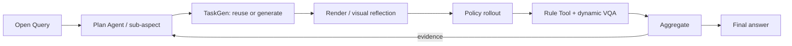
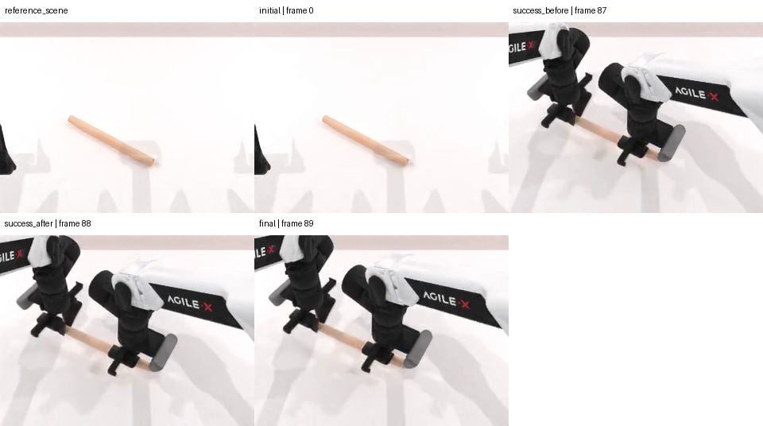

# MEA method evidence: eval_20260730_b44_grab_roller_plan_agent_live13

> This is a compact view of real run artifacts. The complete machine audit remains in the evaluation directory.

## 1. Query and fixed policy scope

> 只回答这个有界候选：当一个与目标滚筒外观相同、可物理交互的非目标滚筒比目标更靠近机器人时，是否存在一个成功样本？把本候选的实验成功定义为目标滚筒最终高度不低于0.8米且非目标滚筒最终高度低于0.8米；同时报告两者最终高度之差。完成 official control 与这一候选后即可停止。

```json
{
  "binding_mode": "single_task_single_checkpoint_open_world",
  "task_name": "grab_roller",
  "task_profile": null,
  "policy": {
    "name": "ACT",
    "checkpoint_setting": "demo_clean",
    "expert_data_num": 50,
    "language_conditioned": false
  },
  "checkpoint": {
    "policy_name": "ACT",
    "checkpoint_setting": "demo_clean",
    "expert_data_num": 50,
    "checkpoint_id": "act-grab_roller/demo_clean-50",
    "ready": true
  },
  "round_budget": 2,
  "episodes_per_round": [
    1,
    1
  ]
}
```

One evaluation keeps this task and policy checkpoint fixed. Adaptation happens only across this task's sub-aspects/variants.

## 2. Paper-level data flow



## 3. Initial decomposition

```json
{
  "evaluation_goal": "answer_open_query_with_evidence: 只回答这个有界候选：当一个与目标滚筒外观相同、可物理交互的非目标滚筒比目标更靠近机器人时，是否存在一个成功样本？把本候选的实验成功定义为目标滚筒最终高度不低于0.8米且非目标滚筒最终高度低于0.8米；同时报告两者最终高度之差。完成 official control 与这一候选后即可停止。",
  "selected_aspect_ids": null,
  "requested_template_ids": [
    "task_execution.official_baseline"
  ],
  "first_round": "round_1",
  "planning_state": "stopped_after_round_2_evidence_sufficient"
}
```

- Query interpretation trace: [prompt](artifacts/plan/query_interpretation_prompt.md) / [response 1](artifacts/plan/query_interpretation_response_1.txt) / [response 2](artifacts/plan/query_interpretation_response_2.txt)

## 4.1. round_1: task_execution.official_baseline

### Plan → TaskGen

- Task: `grab_roller`
- Instruction: 只回答这个有界候选：当一个与目标滚筒外观相同、可物理交互的非目标滚筒比目标更靠近机器人时，是否存在一个成功样本？把本候选的实验成功定义为目标滚筒最终高度不低于0.8米且非目标滚筒最终高度低于0.8米；同时报告两者最终高度之差。完成 official control 与这一候选后即可停止。

### TaskGen output

- Route: `official`
- Materialization: `official_passthrough`
- Child run: `run_20260730_b44_grab_roller_plan_agent_live13_round_1`
- Validation gates: {"generation_attempts": null, "checker_fixtures": null, "vision_passed": null, "expert_passed": null}
- Official passthrough marker: [round_1_overlay.yml](code/round_1_overlay.yml)
- VariantSpec: [round_1_variant_spec.json](data/round_1_variant_spec.json)

### Render / scene check


### Policy rollout

```json
{
  "backend": "ACT",
  "seeds": [
    100301
  ],
  "pipeline_passed": true,
  "policy_success": 1.0
}
```

[Open policy video](assets/round_1_act.mp4)

<video src="assets/round_1_act.mp4" controls width="720"></video>

### Tool / VQA

- Tool route: `reuse`
- Metric: `official_check_success`
- Measurements: [{"role": "policy_under_evaluation", "policy_name": "ACT", "seed": 100301, "value": true, "unit": null, "passed": true}]
- VQA status: `passed`; conflict: `False`
- VQA phenomena: [{"id": "roller_visibly_lifted", "observed": true, "description": "The roller is visibly lifted by both robot arms.", "confidence": 1.0, "frame_ids": ["success_after"]}]



### Aggregate -> next decision

- Aggregate: `passed`
- Policy success: `1.0`
- Decision: {"action": "continue", "transition": "switch_concern", "decision_reason": "provider_authored_open_world_step", "observation_summary": "This test isolates the effect of the non-target roller's proximity on the policy's ability to achieve the success conditions defined in the Query. It directly addresses the Query's core uncertainty by introducing a controlled perturbation to the scene.", "answered_query": false, "evidence_sufficient": null, "claim_verdict": null, "stop_reason": null}

## 4.2. round_2: task_execution.non_target_proximity_effect

### Plan → TaskGen

- Task: `grab_roller`
- Instruction: 只回答这个有界候选：当一个与目标滚筒外观相同、可物理交互的非目标滚筒比目标更靠近机器人时，是否存在一个成功样本？把本候选的实验成功定义为目标滚筒最终高度不低于0.8米且非目标滚筒最终高度低于0.8米；同时报告两者最终高度之差。完成 official control 与这一候选后即可停止。
Scene need: Place a non-target roller with identical appearance closer to the robot than the target roller. Preserve unchanged: task identity; policy checkpoint.
Checker need: A checker is needed to verify the experimental success conditions: the target roller's final height is at least 0.8 meters, and the non-target roller's final height is below 0.8 meters. Numeric Rule Tool needed to report the final height difference between the target and non-target rollers. Hypothesis: When a non-target roller with the same appearance as the target roller is placed closer to the robot than the target roller, the policy will still successfully achieve the target roller's final height of at least 0.8 meters while keeping the non-target roller's final height below 0.8 meters.

### TaskGen output

- Route: `generic_provider_scene_checker_codegen`
- Materialization: `generic_provider_scene_checker_codegen`
- Child run: `run_20260730_b44_grab_roller_plan_agent_live13_round_2`
- Validation gates: {"generation_attempts": 1, "checker_fixtures": "2/2", "vision_passed": true, "expert_passed": true}
- Proposal: [proposal.json](artifacts/taskgen/round_2/generation/proposal.json)
- Provider trace: [prompt](artifacts/taskgen/round_2/generation/code_prompt.md) / [response](artifacts/taskgen/round_2/generation/provider_response.txt)
- Full task artifact: [round_2_task.py](code/round_2_task.py)

### Render / scene check


### Policy rollout

```json
{
  "backend": "ACT",
  "seeds": [
    100301
  ],
  "pipeline_passed": true,
  "policy_success": 1.0
}
```

[Open policy video](assets/round_2_act.mp4)

<video src="assets/round_2_act.mp4" controls width="720"></video>

### Tool / VQA

- Tool route: `typed_metric_spec_compile`
- Metric: `query_derived_metric`
- Measurements: [{"role": "policy_under_evaluation", "policy_name": "ACT", "seed": 100301, "value": 0.05838477611541748, "unit": "m", "passed": null}]
- [Open generated/reused Tool source](code/round_2_tool.py)
- VQA status: `passed`; conflict: `False`
- VQA phenomena: [{"id": "roller_visibly_lifted", "observed": true, "description": "The roller is visibly lifted by both robot arms in the final frame.", "confidence": 0.95, "frame_ids": ["final"]}]


### Aggregate -> next decision

- Aggregate: `passed`
- Policy success: `1.0`
- Decision: {"action": "stop", "transition": "stop", "decision_reason": "plan_agent_evidence_sufficiency", "observation_summary": "A definitive pass candidate witnesses the existential claim.", "answered_query": true, "evidence_sufficient": true, "claim_verdict": "supported", "stop_reason": "evidence_sufficient"}

## 5. Final answer to the original Query

> 是的，存在一个成功样本。

```json
{
  "findings": [
    "目标滚筒的最终高度不低于0.8米，非目标滚筒的最终高度低于0.8米。",
    "目标滚筒与非目标滚筒的最终高度差为0.0584米。"
  ],
  "recommended_next_step": "若需更广泛的结论，建议增加样本数量并进行多种场景的测试。",
  "limitations": [
    "证据包含2个样本，种子为[100301]。",
    "本次评估基于有限域的查询充分性协议，不能作为统计泛化的保证。",
    "至少一个候选项的结论基于生成的检查器，不能视为官方基准的成功结果。",
    "生成的检查器尚未被认证为与官方核心谓词等效，其结论应视为实验性。",
    "Evidence contains N=2 policy episodes at seeds [100301].",
    "The run stopped because the finite query-sufficiency contract was satisfied; this is not a statistical generalization guarantee."
  ]
}
```

## 6. Boundaries

- Policy results and pipeline status are reported separately.
- Expert evidence, when present, is a solvability/instrumentation gate, not evaluated-policy performance.
- Few-shot N=1 rounds demonstrate method wiring, not benchmark-level generalization.
- Missing artifacts are shown as N/A; this report never substitutes proxy images or invented values.

## 7. Raw artifact index

- [Payload inventory with bytes and SHA-256](evidence_bundle_manifest.json)

### Append-only completed-round Tool reuse audit

```json
{
  "repair_id": "live13_exact_tool_reuse_v1",
  "act_rollouts_started": 0,
  "first_query_route": "typed_metric_spec_compile",
  "first_query_measurements": [
    0.05838477611541748
  ],
  "exact_reuse_route": "run_local_reuse",
  "exact_reuse_provider_called": false,
  "aggregate_status": "passed"
}
```

This audit reuses completed policy telemetry and starts no simulator or policy rollout. It proves exact run-local reuse, not independent cross-evaluation reuse.

- Server source: `mea/evaluation_runs/eval_20260730_b44_grab_roller_plan_agent_live13/manifest.json`
- Server source: `mea/evaluation_runs/eval_20260730_b44_grab_roller_plan_agent_live13/plan/evaluation_plan.json`
- Server source: `mea/evaluation_runs/eval_20260730_b44_grab_roller_plan_agent_live13/plan/bound_task_session.json`
- Server source: `mea/evaluation_runs/eval_20260730_b44_grab_roller_plan_agent_live13/summary/evidence_bundle.json`
- Server source: `mea/evaluation_runs/eval_20260730_b44_grab_roller_plan_agent_live13/answer/answer.json`
- Server source: `mea/evaluation_runs/eval_20260730_b44_grab_roller_plan_agent_live13/evaluation_report.md`
