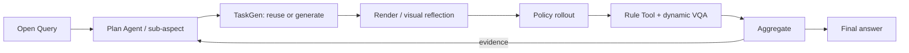

# MEA method evidence: eval_20260805_batch37_clean_flagship_press_stapler_s1000_v7

> Compact, movable view of one real method run. Complete raw telemetry and Aggregate payloads remain in the server evaluation directory.

## 1. Query and execution scope

> Does there exist a bounded, executable scene concern beyond the unchanged official press_stapler task under which this policy exposes a measured weakness? Observe the control, then let the Plan Agent invent and refine the most informative concerns from evidence. I provide no aspect, object, axis, magnitude, relation, threshold, template, checker code, or metric. Generate only the scene, checker, Rule Tool, or VQA Tool actually required by each Proposal. A generated checker must preserve official success as a required conjunct and add only directly observable current-state semantics. A diagnostic Tool must remain separate from success. After a valid success, the evidence must choose a genuinely different semantic concern or an evidence-grounded boundary refinement rather than repeat the same test. The Plan Agent must propose stop as soon as a definitive failure witness has an evidence-backed diagnosis. If executable supported concerns become informationally saturated without such a witness, it must actively stop and answer only the tested scope.

- Task: `press_stapler`
- Policy: `SmolVLA`
- Checkpoint: `lerobot/smolvla_robotwin`
- Round budget / evidence episodes per round: `20` / `[1, 0, 1, 1, 1, 1, 1, 1, 1, 1, 1]`

## 2. Paper-level data flow

## 3. Plan Agent trace

- Goal: answer_open_query_with_evidence: Does there exist a bounded, executable scene concern beyond the unchanged official press_stapler task under which this policy exposes a measured weakness? Observe the control, then let the Plan Agent invent and refine the most informative concerns from evidence. I provide no aspect, object, axis, magnitude, relation, threshold, template, checker code, or metric. Generate only the scene, checker, Rule Tool, or VQA Tool actually required by each Proposal. A generated checker must preserve official success as a required conjunct and add only directly observable current-state semantics. A diagnostic Tool must remain separate from success. After a valid success, the evidence must choose a genuinely different semantic concern or an evidence-grounded boundary refinement rather than repeat the same test. The Plan Agent must propose stop as soon as a definitive failure witness has an evidence-backed diagnosis. If executable supported concerns become informationally saturated without such a witness, it must actively stop and answer only the tested scope.
- Initial round: `round_1`
- Final planning state: `stopped_after_round_11`
- Query interpretation trace: [prompt](artifacts/plan/query_interpretation_prompt.md) / [response 1](artifacts/plan/query_interpretation_response_1.txt) / [response 2](artifacts/plan/query_interpretation_response_2.txt)

## 4.1. `round_1` — task_execution.official_baseline

### Plan → TaskGen

- Task: `press_stapler`
- Route/materialization: `official` / `official_passthrough`
- Gates: {"generation_attempts": null, "checker_fixtures": null, "vision_passed": null, "expert_passed": null}
- Generated/reused source: N/A (artifact was not present)

### Render / scene check

N/A - no real scene image was found.

### Rollout

- Backend/seeds: `SmolVLA` / `[1000]`
- Pipeline/policy success: `True` / `1.0`

[Open policy video](assets/round_1_act.mp4)

<video src="assets/round_1_act.mp4" controls width="720"></video>

### Tool / VQA

- Tool: `reuse` → `official_check_success`
- Values: [{"role": "policy_under_evaluation", "policy_name": "SmolVLA", "seed": 1000, "value": true, "unit": null, "passed": true}]
- VQA status: `None`; conflict: `None`

### Aggregate -> next decision

- Aggregate: {"status": "passed", "source_count": 1, "episode_result_count": 1, "unique_episode_count": 1, "metric_ids": ["official_check_success"], "input_issue_count": 0}
- Decision: {"action": "continue", "transition": "switch_concern", "decision_reason": "provider_authored_open_world_step", "observation_summary": "The unchanged official-scene control succeeded with official_check_success=1.0, so repeating the baseline is no longer informative. The next priority is a bounded scene-level robustness concern using the advertised actor-position perturbation. A small lateral displacement tests whether the policy can reacquire and physically engage the stapler; the required checker gives a directly observable combined success predicate, while the Rule Tool independently diagnoses terminal TCP proximity.", "answered_query": false, "evidence_sufficient": null, "claim_verdict": null, "stop_reason": null}

## 4.2. `round_2` — scene_robustness.initial_lateral_displacement

### Plan → TaskGen

- Task: `press_stapler`
- Route/materialization: `generic_provider_scene_checker_codegen` / `generic_provider_scene_checker_codegen`
- Gates: {"generation_attempts": null, "checker_fixtures": null, "vision_passed": null, "expert_passed": null}
- Proposal: [proposal.json](artifacts/taskgen/round_2/generation/proposal.json)
- Generated/reused source: N/A (artifact was not present)

### Render / scene check

N/A - no real scene image was found.

### Rollout

- Backend/seeds: `SmolVLA` / `[1000]`
- Pipeline/policy success: `False` / `None`

N/A - no evaluated-policy video was found.

### Tool / VQA

- Tool: `None` → `None`
- Values: []
- VQA status: `None`; conflict: `None`

### Aggregate -> next decision

- Aggregate: {"status": "skipped", "source_count": null, "episode_result_count": null, "unique_episode_count": null, "metric_ids": [], "input_issue_count": 0}
- Decision: {"action": "continue", "transition": "switch_concern", "decision_reason": "provider_authored_open_world_step", "observation_summary": "The unchanged official control succeeded, so the next test should be an executable bounded concern beyond baseline. The prior +0.03 m lateral-shift attempt produced no policy rollout because TaskGen rejected its checker, making that outcome ambiguous rather than evidence of robustness or failure. Its expert positive fixture provides a grounded directly observable terminal geometry: stapler [-0.097097, 0.011531, 0.741] and left TCP [-0.127417, 0.022307, 0.810949], approximately 0.077 m apart. This proposal corrects the invalid checker by explicitly requiring the official predicate as a boolean conjunct and uses a nearby evidence-bracketed 0.080 m terminal distance condition that remains satisfiable by that expert fixture. The Rule Tool separately diagnoses the same terminal scalar.", "answered_query": false, "evidence_sufficient": null, "claim_verdict": null, "stop_reason": null}

## 4.3. `round_3` — scene_robustness.lateral_shift_terminal_left_tcp_proximity

### Plan → TaskGen

- Task: `press_stapler`
- Route/materialization: `generic_provider_scene_checker_codegen` / `generic_provider_scene_checker_codegen`
- Gates: {"generation_attempts": 2, "checker_fixtures": "2/2", "vision_passed": true, "expert_passed": true}
- Proposal: [proposal.json](artifacts/taskgen/round_3/generation/proposal.json)
- Provider trace: [prompt](artifacts/taskgen/round_3/generation/code_prompt.md) / [response](artifacts/taskgen/round_3/generation/provider_response.txt)
- Task artifact: [round_3_task.py](code/round_3_task.py)

### Render / scene check

### Rollout

- Backend/seeds: `SmolVLA` / `[1000]`
- Pipeline/policy success: `True` / `1.0`

[Open policy video](assets/round_3_act.mp4)

<video src="assets/round_3_act.mp4" controls width="720"></video>

### Tool / VQA

- Tool: `provider_python_codegen` → `terminal_left_tcp_to_stapler_distance`
- Values: [{"role": "policy_under_evaluation", "policy_name": "SmolVLA", "seed": 1000, "value": 0.07994672000122097, "unit": "m", "passed": null}]
- [Open generated/reused Tool source](code/round_3_tool.py)
- VQA status: `None`; conflict: `None`

### Aggregate -> next decision

- Aggregate: {"status": "passed", "source_count": 2, "episode_result_count": 2, "unique_episode_count": 2, "metric_ids": ["generated_check_success", "terminal_left_tcp_to_stapler_distance"], "input_issue_count": 0}
- Decision: {"action": "continue", "transition": "switch_concern", "decision_reason": "provider_authored_open_world_step", "observation_summary": "Round 3 succeeded, but its terminal left-TCP-to-stapler distance was 0.07994672000122097 m, only 0.00005327999877903 m below the retained 0.080 m terminal criterion. This finite observation grounds a narrowly bracketed lateral-displacement boundary refinement rather than an unsupported new magnitude. The prior +0.030 m shift therefore does not establish weakness, while the additional +0.001 m displacement is the most informative executable test of whether that near-threshold terminal retargeting margin is robust.", "answered_query": false, "evidence_sufficient": null, "claim_verdict": null, "stop_reason": null}

## 4.4. `round_4` — scene_robustness.lateral_shift_boundary_refinement

### Plan → TaskGen

- Task: `press_stapler`
- Route/materialization: `generic_provider_scene_checker_codegen` / `generic_provider_scene_checker_codegen`
- Gates: {"generation_attempts": 2, "checker_fixtures": "2/2", "vision_passed": true, "expert_passed": true}
- Proposal: [proposal.json](artifacts/taskgen/round_4/generation/proposal.json)
- Provider trace: [prompt](artifacts/taskgen/round_4/generation/code_prompt.md) / [response](artifacts/taskgen/round_4/generation/provider_response.txt)
- Task artifact: [round_4_task.py](code/round_4_task.py)

### Render / scene check

### Rollout

- Backend/seeds: `SmolVLA` / `[1000]`
- Pipeline/policy success: `True` / `1.0`

[Open policy video](assets/round_4_act.mp4)

<video src="assets/round_4_act.mp4" controls width="720"></video>

### Tool / VQA

- Tool: `run_local_reuse` → `terminal_left_tcp_to_stapler_distance`
- Values: [{"role": "policy_under_evaluation", "policy_name": "SmolVLA", "seed": 1000, "value": 0.07990267815148812, "unit": "m", "passed": null}]
- [Open generated/reused Tool source](code/round_4_tool.py)
- VQA status: `None`; conflict: `None`

### Aggregate -> next decision

- Aggregate: {"status": "passed", "source_count": 2, "episode_result_count": 2, "unique_episode_count": 2, "metric_ids": ["generated_check_success", "terminal_left_tcp_to_stapler_distance"], "input_issue_count": 0}
- Decision: {"action": "continue", "transition": "switch_concern", "decision_reason": "provider_authored_open_world_step", "observation_summary": "The +0.030 m lateral-shift experiment succeeded at the 0.080 m criterion, but its terminal left-TCP-to-stapler distance was 0.07994672000122097 m; the +0.031 m success measured 0.07990267815148812 m. These successful measurements bracket 0.07992 m, making a 0.07992 m terminal boundary an evidence-grounded refinement rather than another uncalibrated lateral-shift escalation. This directly tests whether the observed near-boundary retargeting margin yields a definitive, diagnosable experimental failure while retaining the official core predicate.", "answered_query": false, "evidence_sufficient": null, "claim_verdict": null, "stop_reason": null}

## 4.5. `round_5` — scene_robustness.lateral_shift_terminal_proximity_boundary

### Plan → TaskGen

- Task: `press_stapler`
- Route/materialization: `generic_provider_scene_checker_codegen` / `generic_provider_scene_checker_codegen`
- Gates: {"generation_attempts": 2, "checker_fixtures": "2/2", "vision_passed": true, "expert_passed": true}
- Proposal: [proposal.json](artifacts/taskgen/round_5/generation/proposal.json)
- Provider trace: [prompt](artifacts/taskgen/round_5/generation/code_prompt.md) / [response](artifacts/taskgen/round_5/generation/provider_response.txt)
- Task artifact: [round_5_task.py](code/round_5_task.py)

### Render / scene check

### Rollout

- Backend/seeds: `SmolVLA` / `[1000]`
- Pipeline/policy success: `True` / `1.0`

[Open policy video](assets/round_5_act.mp4)

<video src="assets/round_5_act.mp4" controls width="720"></video>

### Tool / VQA

- Tool: `run_local_reuse` → `terminal_left_tcp_to_stapler_distance`
- Values: [{"role": "policy_under_evaluation", "policy_name": "SmolVLA", "seed": 1000, "value": 0.07982503806186039, "unit": "m", "passed": null}]
- [Open generated/reused Tool source](code/round_5_tool.py)
- VQA status: `None`; conflict: `None`

### Aggregate -> next decision

- Aggregate: {"status": "passed", "source_count": 2, "episode_result_count": 2, "unique_episode_count": 2, "metric_ids": ["generated_check_success", "terminal_left_tcp_to_stapler_distance"], "input_issue_count": 0}
- Decision: {"action": "continue", "transition": "switch_concern", "decision_reason": "provider_authored_open_world_step", "observation_summary": "The +0.030 m world-x perturbation produced successful experimental-checker outcomes in rounds 3-5, with the latest terminal left-TCP-to-stapler distance measured as 0.07982503806186039 m under the 0.07992 m threshold, so that tested axis has not exposed a weakness. This round probes the orthogonal world-y displacement while retaining the directly observable TCP-distance criterion and the official predicate conjunct. The earlier contact-based checker was rejected during materialization, so the proposal uses the validated current-state distance observable instead.", "answered_query": false, "evidence_sufficient": null, "claim_verdict": null, "stop_reason": null}

## 4.6. `round_6` — scene_robustness.orthogonal_world_y_displacement_terminal_tcp_proximity

### Plan → TaskGen

- Task: `press_stapler`
- Route/materialization: `generic_provider_scene_checker_codegen` / `generic_provider_scene_checker_codegen`
- Gates: {"generation_attempts": 2, "checker_fixtures": "2/2", "vision_passed": true, "expert_passed": true}
- Proposal: [proposal.json](artifacts/taskgen/round_6/generation/proposal.json)
- Provider trace: [prompt](artifacts/taskgen/round_6/generation/code_prompt.md) / [response](artifacts/taskgen/round_6/generation/provider_response.txt)
- Task artifact: [round_6_task.py](code/round_6_task.py)

### Render / scene check

### Rollout

- Backend/seeds: `SmolVLA` / `[1000]`
- Pipeline/policy success: `True` / `1.0`

[Open policy video](assets/round_6_act.mp4)

<video src="assets/round_6_act.mp4" controls width="720"></video>

### Tool / VQA

- Tool: `run_local_reuse` → `terminal_left_tcp_to_stapler_distance`
- Values: [{"role": "policy_under_evaluation", "policy_name": "SmolVLA", "seed": 1000, "value": 0.07998626327914184, "unit": "m", "passed": null}]
- [Open generated/reused Tool source](code/round_6_tool.py)
- VQA status: `None`; conflict: `None`

### Aggregate -> next decision

- Aggregate: {"status": "passed", "source_count": 2, "episode_result_count": 2, "unique_episode_count": 2, "metric_ids": ["generated_check_success", "terminal_left_tcp_to_stapler_distance"], "input_issue_count": 0}
- Decision: {"action": "continue", "transition": "switch_concern", "decision_reason": "provider_authored_open_world_step", "observation_summary": "Rounds 3–6 successfully retained the 0.080 m terminal proximity criterion under world-x and world-y displacement; their terminal distances remained near the grounded 0.080 m scale (0.079825–0.079986 m). A +0.030 m world-z translation probes the orthogonal vertical-reach concern rather than repeating lateral displacement or merely tightening the same boundary, while the advertised current-state positions directly support both the satisfiable checker relation and its diagnostic measurement.", "answered_query": false, "evidence_sufficient": null, "claim_verdict": null, "stop_reason": null}

## 4.7. `round_7` — scene_robustness.vertical_reach_displacement_terminal_tcp_proximity

### Plan → TaskGen

- Task: `press_stapler`
- Route/materialization: `generic_provider_scene_checker_codegen` / `generic_provider_scene_checker_codegen`
- Gates: {"generation_attempts": 2, "checker_fixtures": "2/2", "vision_passed": true, "expert_passed": true}
- Proposal: [proposal.json](artifacts/taskgen/round_7/generation/proposal.json)
- Provider trace: [prompt](artifacts/taskgen/round_7/generation/code_prompt.md) / [response](artifacts/taskgen/round_7/generation/provider_response.txt)
- Task artifact: [round_7_task.py](code/round_7_task.py)

### Render / scene check

### Rollout

- Backend/seeds: `SmolVLA` / `[1000]`
- Pipeline/policy success: `True` / `1.0`

[Open policy video](assets/round_7_act.mp4)

<video src="assets/round_7_act.mp4" controls width="720"></video>

### Tool / VQA

- Tool: `run_local_reuse` → `terminal_left_tcp_to_stapler_distance`
- Values: [{"role": "policy_under_evaluation", "policy_name": "SmolVLA", "seed": 1000, "value": 0.07992299451213755, "unit": "m", "passed": null}]
- [Open generated/reused Tool source](code/round_7_tool.py)
- VQA status: `None`; conflict: `None`

### Aggregate -> next decision

- Aggregate: {"status": "passed", "source_count": 2, "episode_result_count": 2, "unique_episode_count": 2, "metric_ids": ["generated_check_success", "terminal_left_tcp_to_stapler_distance"], "input_issue_count": 0}
- Decision: {"action": "continue", "transition": "switch_concern", "decision_reason": "provider_authored_open_world_step", "observation_summary": "Rounds 3-5 established success for the +0.030 m world-x scene shift at terminal distances of 0.0799467 m and 0.0798250 m, so merely increasing the displacement is not the most informative next step. The failed checker-fixture evidence supplied an expert terminal left-TCP-to-stapler distance of approximately 0.0770 m, while the policy's measured 0.0798250 m lies above 0.07980 m. Thus 0.07980 m is an evidence-grounded, directly observable boundary that remains satisfiable by the expert and can yield a definitive, diagnostically measured failure witness.", "answered_query": false, "evidence_sufficient": null, "claim_verdict": null, "stop_reason": null}

## 4.8. `round_8` — scene_robustness.lateral_shift.evidence_bracketed_terminal_tcp_margin

### Plan → TaskGen

- Task: `press_stapler`
- Route/materialization: `generic_provider_scene_checker_codegen` / `generic_provider_scene_checker_codegen`
- Gates: {"generation_attempts": 2, "checker_fixtures": "2/2", "vision_passed": true, "expert_passed": true}
- Proposal: [proposal.json](artifacts/taskgen/round_8/generation/proposal.json)
- Provider trace: [prompt](artifacts/taskgen/round_8/generation/code_prompt.md) / [response](artifacts/taskgen/round_8/generation/provider_response.txt)
- Task artifact: [round_8_task.py](code/round_8_task.py)

### Render / scene check

### Rollout

- Backend/seeds: `SmolVLA` / `[1000]`
- Pipeline/policy success: `True` / `1.0`

[Open policy video](assets/round_8_act.mp4)

<video src="assets/round_8_act.mp4" controls width="720"></video>

### Tool / VQA

- Tool: `run_local_reuse` → `terminal_left_tcp_to_stapler_distance`
- Values: [{"role": "policy_under_evaluation", "policy_name": "SmolVLA", "seed": 1000, "value": 0.0796477768203362, "unit": "m", "passed": null}]
- [Open generated/reused Tool source](code/round_8_tool.py)
- VQA status: `None`; conflict: `None`

### Aggregate -> next decision

- Aggregate: {"status": "passed", "source_count": 2, "episode_result_count": 2, "unique_episode_count": 2, "metric_ids": ["generated_check_success", "terminal_left_tcp_to_stapler_distance"], "input_issue_count": 0}
- Decision: {"action": "continue", "transition": "switch_concern", "decision_reason": "provider_authored_open_world_step", "observation_summary": "The control and all tested translational concerns succeeded, including world-x, world-y, and world-z displacement. The latest world-x result satisfied the tightened terminal predicate with a measured distance of 0.0796477768203362 m, so further translation without a newly bracketed failure boundary would repeat a successful concern. Initial yaw is a distinct, bounded scene semantic that tests whether the policy's approach and pressing behavior depends on the stapler's visual/geometric orientation. The 0.07980 m terminal relation remains evidence-grounded and directly observable, while the Rule Tool separately reports its terminal scalar diagnosis.", "answered_query": false, "evidence_sufficient": null, "claim_verdict": null, "stop_reason": null}

## 4.9. `round_9` — scene_robustness.initial_stapler_yaw_orientation

### Plan → TaskGen

- Task: `press_stapler`
- Route/materialization: `generic_provider_scene_checker_codegen` / `generic_provider_scene_checker_codegen`
- Gates: {"generation_attempts": 2, "checker_fixtures": "2/2", "vision_passed": true, "expert_passed": true}
- Proposal: [proposal.json](artifacts/taskgen/round_9/generation/proposal.json)
- Provider trace: [prompt](artifacts/taskgen/round_9/generation/code_prompt.md) / [response](artifacts/taskgen/round_9/generation/provider_response.txt)
- Task artifact: [round_9_task.py](code/round_9_task.py)

### Render / scene check

### Rollout

- Backend/seeds: `SmolVLA` / `[1000]`
- Pipeline/policy success: `True` / `1.0`

[Open policy video](assets/round_9_act.mp4)

<video src="assets/round_9_act.mp4" controls width="720"></video>

### Tool / VQA

- Tool: `run_local_reuse` → `terminal_left_tcp_to_stapler_distance`
- Values: [{"role": "policy_under_evaluation", "policy_name": "SmolVLA", "seed": 1000, "value": 0.07974978433448847, "unit": "m", "passed": null}]
- [Open generated/reused Tool source](code/round_9_tool.py)
- VQA status: `None`; conflict: `None`

### Aggregate -> next decision

- Aggregate: {"status": "passed", "source_count": 2, "episode_result_count": 2, "unique_episode_count": 2, "metric_ids": ["generated_check_success", "terminal_left_tcp_to_stapler_distance"], "input_issue_count": 0}
- Decision: {"action": "continue", "transition": "switch_concern", "decision_reason": "provider_authored_open_world_step", "observation_summary": "The control and all completed translation, yaw, and evidence-bracketed terminal-proximity tests succeeded. In particular, the most recent +15 degree world-z yaw test passed with terminal left-TCP-to-stapler distance 0.07974978433448847 m, below the evidence-grounded 0.07980 m predicate. Further enlarging a previously successful displacement or yaw lacks a demonstrated boundary, so the priority shifts to the orthogonal pitch-alignment concern, which directly changes the stapler press-surface geometry while retaining a previously validated, directly observable terminal criterion.", "answered_query": false, "evidence_sufficient": null, "claim_verdict": null, "stop_reason": null}

## 4.10. `round_10` — scene_robustness.initial_stapler_pitch_alignment

### Plan → TaskGen

- Task: `press_stapler`
- Route/materialization: `generic_provider_scene_checker_codegen` / `generic_provider_scene_checker_codegen`
- Gates: {"generation_attempts": 2, "checker_fixtures": "2/2", "vision_passed": true, "expert_passed": true}
- Proposal: [proposal.json](artifacts/taskgen/round_10/generation/proposal.json)
- Provider trace: [prompt](artifacts/taskgen/round_10/generation/code_prompt.md) / [response](artifacts/taskgen/round_10/generation/provider_response.txt)
- Task artifact: [round_10_task.py](code/round_10_task.py)

### Render / scene check

### Rollout

- Backend/seeds: `SmolVLA` / `[1000]`
- Pipeline/policy success: `True` / `1.0`

[Open policy video](assets/round_10_act.mp4)

<video src="assets/round_10_act.mp4" controls width="720"></video>

### Tool / VQA

- Tool: `run_local_reuse` → `terminal_left_tcp_to_stapler_distance`
- Values: [{"role": "policy_under_evaluation", "policy_name": "SmolVLA", "seed": 1000, "value": 0.07976609109967475, "unit": "m", "passed": null}]
- [Open generated/reused Tool source](code/round_10_tool.py)
- VQA status: `None`; conflict: `None`

### Aggregate -> next decision

- Aggregate: {"status": "passed", "source_count": 2, "episode_result_count": 2, "unique_episode_count": 2, "metric_ids": ["generated_check_success", "terminal_left_tcp_to_stapler_distance"], "input_issue_count": 0}
- Decision: {"action": "continue", "transition": "switch_concern", "decision_reason": "provider_authored_open_world_step", "observation_summary": "The unchanged control succeeded, and the completed translation, yaw, and pitch concerns also succeeded under the experimental terminal criterion. In particular, the yaw and pitch tests produced terminal left-TCP-to-stapler distances of 0.07974978433448847 m and 0.07976609109967475 m, respectively, below the evidence-grounded 0.07980 m threshold. Rather than repeating a successful translation or yaw/pitch test, world-x roll isolates a genuinely untested orientation degree of freedom while retaining the same directly observable, already-materialized diagnostic relation and bounded scene-only intervention.", "answered_query": false, "evidence_sufficient": null, "claim_verdict": null, "stop_reason": null}

## 4.11. `round_11` — scene_robustness.initial_stapler_roll_orientation

### Plan → TaskGen

- Task: `press_stapler`
- Route/materialization: `generic_provider_scene_checker_codegen` / `generic_provider_scene_checker_codegen`
- Gates: {"generation_attempts": 2, "checker_fixtures": "2/2", "vision_passed": true, "expert_passed": true}
- Proposal: [proposal.json](artifacts/taskgen/round_11/generation/proposal.json)
- Provider trace: [prompt](artifacts/taskgen/round_11/generation/code_prompt.md) / [response](artifacts/taskgen/round_11/generation/provider_response.txt)
- Task artifact: [round_11_task.py](code/round_11_task.py)

### Render / scene check

### Rollout

- Backend/seeds: `SmolVLA` / `[1000]`
- Pipeline/policy success: `True` / `1.0`

[Open policy video](assets/round_11_act.mp4)

<video src="assets/round_11_act.mp4" controls width="720"></video>

### Tool / VQA

- Tool: `run_local_reuse` → `terminal_left_tcp_to_stapler_distance`
- Values: [{"role": "policy_under_evaluation", "policy_name": "SmolVLA", "seed": 1000, "value": 0.07961811625797877, "unit": "m", "passed": null}]
- [Open generated/reused Tool source](code/round_11_tool.py)
- VQA status: `None`; conflict: `None`

### Aggregate -> next decision

- Aggregate: {"status": "passed", "source_count": 2, "episode_result_count": 2, "unique_episode_count": 2, "metric_ids": ["generated_check_success", "terminal_left_tcp_to_stapler_distance"], "input_issue_count": 0}
- Decision: {"action": "stop", "transition": "stop", "decision_reason": "provider_authored_open_world_step", "observation_summary": "Rounds 3-11 successfully covered bounded initial stapler translations along world x, y, and z plus yaw, pitch, and roll orientation changes. The latest roll test succeeded with terminal distance 0.079618 m, and prior x-boundary refinements also succeeded down to a 0.07980 m predicate. These successful experimental outcomes do not supply a failure witness or a scene-factor boundary for further refinement. The simulator card exposes no tracked actors, semantic roles, probe attributes, or semantic telemetry from which to derive another distinct supported scene concern, so further candidate invention would be ungrounded.", "answered_query": false, "evidence_sufficient": null, "claim_verdict": null, "stop_reason": null}

## 5. Final answer to the original Query

> 结论不确定：在本次已验证的有界实验范围内，未发现该策略的明确弱点见证；但原始接触型+0.03 m world-x 平移候选未能执行，因此不能否定仍存在其他未测试的弱点。

- Finding: 官方控制任务在1个策略回合、种子1000下成功，official_check_success=1.0。
- Finding: 9个已执行实验候选的generated_check_success均为1.0；每个实验回合中官方成功及官方核心谓词也均满足。
- Finding: 9个实验回合的终端左TCP-钉书机距离均由独立诊断Rule Tool报告，整体均值为0.07981838472425856 m，中位数0.07982503806186039 m，范围0.07961811625797877至0.07998626327914184 m。
- Finding: 最紧的已测试实验条件为：world-x +0.030 m平移且终端距离≤0.07980 m；该回合生成检查器成功，诊断距离为0.0796477768203362 m。
- Finding: 未出现VQA与仿真证据冲突；已执行实验的场景、检查器、可解性和诊断工具验证门均通过。
- Finding: 停止原因是信息饱和：现有运行时能力未提供可据证据构造的另一种不同场景语义；这不构成对开放候选空间的鲁棒性结论。
- Next: 优先修复并重新验证未执行的接触型world-x +0.03 m候选：生成一个以官方成功为显式布尔合取项、且能通过专家正例夹具的终端“钉书机与任一夹爪物理接触”检查器，并在多个不同种子上执行；这将直接覆盖当前唯一未测试候选。
- Limitation: 证据包含N=10个策略回合，且均来自同一种子[1000]；不能据此推断跨种子或总体泛化。
- Limitation: 初始候选“world-x +0.03 m平移并要求终端钉书机与任一夹爪物理接触”未执行：其生成检查器未通过正/负夹具验证，策略样本数为0。因此该候选仍未测试，不能将其视作成功或失败。
- Limitation: 原始接触型候选的请求变更、假设、保留条件和所需观测均未被覆盖。
- Limitation: 9个实验结果使用generated_check_success这一预期语义扩展检查器；虽然均要求官方核心谓词为合取项，但official_equivalent=false，因此不能表述为官方benchmark成功。
- Limitation: 候选空间仍开放；停止是agent_saturation_inconclusive，表示无法从已广告的能力继续提出有根据的不同实验，而非证明不存在弱点。
- Limitation: Evidence contains N=10 policy episodes at seeds [1000].
- Limitation: Untested candidates remain: ['dynamic.press.stapler.scene.robustness.initial.lateral.displacement.translating.the.stapler.s.initial.position.by.0.03.m.along.the.world.x.axis.will.expose.a.policy.weakness.the.policy.will.not.satisfy.the.combined.predicate.of.official.task.success.and.terminal.physical.contact.between.the.stapler.and.either.robot.gripper.ee000124987f'].
- Limitation: Tested Query-derived candidate contract requirements remain uncovered: ['intent.d2d4253a14ce9763:required_observation', 'intent.d2d4253a14ce9763:requested_change', 'intent.d2d4253a14ce9763:hypothesis', 'intent.d2d4253a14ce9763:preserved_conditions'].
- Limitation: The Plan Agent stopped because the advertised runtime capabilities contained no further distinct informative experiment. The Query remains inconclusive, the candidate universe may remain open, and untested concerns may still exist.
## 6. Boundaries

- Policy results and pipeline status are reported separately.
- Expert evidence, when present, is a solvability/instrumentation gate, not evaluated-policy performance.
- Few-shot N=1 rounds demonstrate method wiring, not benchmark-level generalization.
- Missing artifacts are shown as N/A; this report never substitutes proxy images or invented values.

## 7. Artifact index

- [Compact machine summary](run_summary.json)
- [Published-file inventory with bytes and SHA-256](evidence_bundle_manifest.json)
- Complete raw source remains server-side at `mea/evaluation_runs/eval_20260805_batch37_clean_flagship_press_stapler_s1000_v7`.
