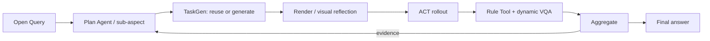

# MEA method evidence: eval_20260729_batch31_open_flagship_live_v13

> This is a compact view of real run artifacts. The complete machine audit remains in the evaluation directory.

## 1. Query and fixed policy scope

> 这个 ACT 策略是否存在一种有界且可实现的场景变化，仍能成功完成 click_bell？请自主选择具体 concern，保持任务目标与接触几何语义不变，只根据真实证据回答。

```json
{
  "binding_mode": "single_task_single_checkpoint_open_world",
  "task_name": "click_bell",
  "task_profile": null,
  "policy": {
    "name": "ACT",
    "checkpoint_setting": "demo_clean",
    "expert_data_num": 50,
    "language_conditioned": false
  },
  "checkpoint": {
    "policy_name": "ACT",
    "checkpoint_setting": "demo_clean",
    "expert_data_num": 50,
    "checkpoint_id": "act-click_bell/demo_clean-50",
    "ready": true
  },
  "round_budget": 2,
  "episodes_per_round": [
    1,
    1
  ]
}
```

One evaluation keeps this task and ACT checkpoint fixed. Adaptation happens only across this task's sub-aspects/variants.

## 2. Paper-level data flow



## 3. Initial decomposition

```json
{
  "evaluation_goal": "answer_open_query_with_evidence: 这个 ACT 策略是否存在一种有界且可实现的场景变化，仍能成功完成 click_bell？请自主选择具体 concern，保持任务目标与接触几何语义不变，只根据真实证据回答。",
  "selected_aspect_ids": null,
  "requested_template_ids": [
    "task_execution.official_baseline"
  ],
  "first_round": "round_1",
  "planning_state": "stopped_after_round_2_evidence_sufficient"
}
```

## 4.1. round_1: task_execution.official_baseline

### Legacy plan intent

```json
{
  "proposal_status": "missing_legacy_projection",
  "task_name": "click_bell",
  "aspect_id": "task_execution.official_baseline",
  "task_instruction": "这个 ACT 策略是否存在一种有界且可实现的场景变化，仍能成功完成 click_bell？请自主选择具体 concern，保持任务目标与接触几何语义不变，只根据真实证据回答。"
}
```

### TaskGen output

- Route: `official`
- Materialization: `official_passthrough`
- Child run: `run_20260729_batch31_open_flagship_live_v13_round_1`
- Full task artifact: [round_1_overlay.yml](code/round_1_overlay.yml)

```yaml
{}
```
- VariantSpec: [round_1_variant_spec.json](data/round_1_variant_spec.json)

### Render / scene check


### ACT rollout

```json
{
  "backend": "ACT",
  "seeds": [
    100405
  ],
  "pipeline_passed": true,
  "policy_success": 1.0
}
```

[Open ACT video](assets/round_1_act.mp4)

<video src="assets/round_1_act.mp4" controls width="720"></video>

### Legacy Tool request

```json
{
  "proposal_status": "missing_legacy_projection",
  "tool_request": {
    "schema_version": 1,
    "task_name": "click_bell",
    "metric": "official_check_success",
    "question": "Did the rollout satisfy the official RoboTwin success check?"
  }
}
```

```json
{
  "route": "reuse",
  "metric": "official_check_success",
  "episodes": [
    {
      "role": "policy_under_evaluation",
      "policy_name": "ACT",
      "seed": 100405,
      "value": true,
      "unit": null,
      "passed": true
    }
  ]
}
```

### Dynamic VQA

```json
{
  "status": "passed",
  "questions": [
    {
      "id": "bell_visibly_pressed",
      "question": "Does the robot visibly press or actuate the target bell?"
    }
  ],
  "phenomena": [
    {
      "id": "bell_visibly_pressed",
      "observed": true,
      "description": "The robot visibly presses the target bell.",
      "confidence": 1.0,
      "frame_ids": [
        "success_before",
        "success_after"
      ]
    }
  ],
  "numeric_consistency": "consistent",
  "evidence_conflict": false
}
```


### Aggregate -> next decision

```json
{
  "aggregate_status": "passed",
  "policy_success": 1.0,
  "decision": {
    "schema_version": 2,
    "action": "continue",
    "transition": "switch_concern",
    "candidate_id": "dynamic.click.bell.robustness.of.the.policy.to.positional.variation.of.the.bell.the.act.policy.can.successfully.complete.the.click.bell.task.when.the.bell.is.shifted.to.a.new.position.within.a.bounded.range.1dfbf75df346",
    "observation_summary": "Directly execute the catalog-free first concern selected for the original Query; no second Planner may replace it before the control evidence is observed.",
    "decision_reason": "provider_authored_open_world_step",
    "answered_query": false,
    "plan_step_source": "provider_free_concern_direct_materialization",
    "plan_step_proposal": {
      "schema_version": 2,
      "action": "propose",
      "aspect_id": "free_concern.robustness.of.the.policy.to.positional.variation.of.the.bell",
      "candidate_id": "dynamic.click.bell.robustness.of.the.policy.to.positional.variation.of.the.bell.the.act.policy.can.successfully.complete.the.click.bell.task.when.the.bell.is.shifted.to.a.new.position.within.a.bounded.range.1dfbf75df346",
      "execution_mode": "reuse_or_generate",
      "experiment_candidate": {
        "schema_version": 2,
        "candidate_id": "dynamic.click.bell.robustness.of.the.policy.to.positional.variation.of.the.bell.the.act.policy.can.successfully.complete.the.click.bell.task.when.the.bell.is.shifted.to.a.new.position.within.a.bounded.range.1dfbf75df346",
        "source_query": "这个 ACT 策略是否存在一种有界且可实现的场景变化，仍能成功完成 click_bell？请自主选择具体 concern，保持任务目标与接触几何语义不变，只根据真实证据回答。",
        "base_task": "click_bell",
        "semantic_concern": "robustness of the policy to positional variation of the bell: The ACT policy can successfully complete the click_bell task when the bell is shifted to a new position within a bounded range.",
        "scene_need": {
          "kind": "adapt",
          "description": "Shift the bell's position horizontally by a small, bounded distance while keeping its size, shape, material, and the overall scene layout unchanged. Preserve unchanged: 任务目标与接触几何语义; size; shape; material; the overall scene layout.",
          "reuse_first": true
        },
        "checker_need": null,
        "rule_tool_need": {
          "kind": "measure",
          "description": "Determine whether the policy successfully activates the bell in the new position. Hypothesis: The ACT policy can successfully complete the click_bell task when the bell is shifted to a new position within a bounded range.",
          "reuse_first": true
        },
        "vqa_tool_need": null,
        "tool_need": {
          "kind": "measure",
          "description": "Determine whether the policy successfully activates the bell in the new position. Hypothesis: The ACT policy can successfully complete the click_bell task when the bell is shifted to a new position within a bounded range.",
          "reuse_first": true
        },
        "evaluation_intent": {
          "schema_version": 1,
          "intent_id": "intent.c7b8b7a89baaba20",
          "source_query": "这个 ACT 策略是否存在一种有界且可实现的场景变化，仍能成功完成 click_bell？请自主选择具体 concern，保持任务目标与接触几何语义不变，只根据真实证据回答。",
          "original_concern": "robustness of the policy to positional variation of the bell",
          "hypothesis": "The ACT policy can successfully complete the click_bell task when the bell is shifted to a new position within a bounded range.",
          "requested_change": "Shift the bell's position horizontally by a small, bounded distance while keeping its size, shape, material, and the overall scene layout unchanged.",
          "preserved_conditions": [
            "任务目标与接触几何语义",
            "size",
            "shape",
            "material",
            "the overall scene layout"
          ],
          "required_observation": "Determine whether the policy successfully activates the bell in the new position."
        },
        "intent_alignment": {
          "schema_version": 1,
          "relationship": "direct",
          "rationale": "Candidate preserves the requested change, hypothesis, and observation semantics.",
          "matched_intent_fields": [
            "requested_change",
            "preserved_conditions",
            "hypothesis",
            "required_observation"
          ],
          "unmatched_intent_fields": []
        }
      },
      "rationale": "Directly execute the catalog-free first concern selected for the original Query; no second Planner may replace it before the control evidence is observed.",
      "answered_query": false
    },
    "round_budget_before_decision": 1,
    "query_assessment": {
      "schema_version": 1,
      "contract": {
        "schema_version": 3,
        "claim_type": "existential",
        "candidate_universe": [
          "dynamic.click.bell.robustness.of.the.policy.to.positional.variation.of.the.bell.the.act.policy.can.successfully.complete.the.click.bell.task.when.the.bell.is.shifted.to.a.new.position.within.a.bounded.range.1dfbf75df346"
        ],
        "required_coverage": {
          "candidate_ids": [
            "dynamic.click.bell.robustness.of.the.policy.to.positional.variation.of.the.bell.the.act.policy.can.successfully.complete.the.click.bell.task.when.the.bell.is.shifted.to.a.new.position.within.a.bounded.range.1dfbf75df346"
          ],
          "minimum_evaluated": 1,
          "minimum_per_group": null
        },
        "round_budget": 1,
        "comparison_groups": null,
        "candidate_universe_closed": false,
        "existential_witness_outcome": "pass",
        "control_requirement": "required"
      },
      "should_stop": false,
      "stop_reason": "continue",
      "claim_verdict": "inconclusive",
      "evidence_sufficient": false,
      "completed_rounds": 0,
      "round_budget": 1,
      "budget_remaining": 1,
      "candidate_universe_closed": false,
      "candidate_discovery_required": true,
      "observed_candidate_ids": [],
      "decisive_candidate_ids": [],
      "conflict_candidate_ids": [],
      "unknown_candidate_ids": [],
      "untested_required_candidate_ids": [
        "dynamic.click.bell.robustness.of.the.policy.to.positional.variation.of.the.bell.the.act.policy.can.successfully.complete.the.click.bell.task.when.the.bell.is.shifted.to.a.new.position.within.a.bounded.range.1dfbf75df346"
      ],
      "untested_candidate_ids": [
        "dynamic.click.bell.robustness.of.the.policy.to.positional.variation.of.the.bell.the.act.policy.can.successfully.complete.the.click.bell.task.when.the.bell.is.shifted.to.a.new.position.within.a.bounded.range.1dfbf75df346"
      ],
      "recommended_candidate_ids": [
        "dynamic.click.bell.robustness.of.the.policy.to.positional.variation.of.the.bell.the.act.policy.can.successfully.complete.the.click.bell.task.when.the.bell.is.shifted.to.a.new.position.within.a.bounded.range.1dfbf75df346"
      ],
      "rationale": "The query contract still has unresolved required evidence.",
      "statistics": {
        "existential_witness_outcome": "pass",
        "witness_candidate_ids": []
      },
      "limitations": [
        "This is a finite-domain stopping prototype, not a statistical generalization guarantee.",
        "The candidate universe is open; exhaustive, no-counterexample, and worst-case conclusions are not licensed."
      ]
    },
    "next_round": {
      "round_id": "round_2",
      "template_id": null,
      "candidate_id": "dynamic.click.bell.robustness.of.the.policy.to.positional.variation.of.the.bell.the.act.policy.can.successfully.complete.the.click.bell.task.when.the.bell.is.shifted.to.a.new.position.within.a.bounded.range.1dfbf75df346",
      "experiment_candidate": {
        "schema_version": 2,
        "candidate_id": "dynamic.click.bell.robustness.of.the.policy.to.positional.variation.of.the.bell.the.act.policy.can.successfully.complete.the.click.bell.task.when.the.bell.is.shifted.to.a.new.position.within.a.bounded.range.1dfbf75df346",
        "source_query": "这个 ACT 策略是否存在一种有界且可实现的场景变化，仍能成功完成 click_bell？请自主选择具体 concern，保持任务目标与接触几何语义不变，只根据真实证据回答。",
        "base_task": "click_bell",
        "semantic_concern": "robustness of the policy to positional variation of the bell: The ACT policy can successfully complete the click_bell task when the bell is shifted to a new position within a bounded range.",
        "scene_need": {
          "kind": "adapt",
          "description": "Shift the bell's position horizontally by a small, bounded distance while keeping its size, shape, material, and the overall scene layout unchanged. Preserve unchanged: 任务目标与接触几何语义; size; shape; material; the overall scene layout.",
          "reuse_first": true
        },
        "checker_need": null,
        "rule_tool_need": {
          "kind": "measure",
          "description": "Determine whether the policy successfully activates the bell in the new position. Hypothesis: The ACT policy can successfully complete the click_bell task when the bell is shifted to a new position within a bounded range.",
          "reuse_first": true
        },
        "vqa_tool_need": null,
        "tool_need": {
          "kind": "measure",
          "description": "Determine whether the policy successfully activates the bell in the new position. Hypothesis: The ACT policy can successfully complete the click_bell task when the bell is shifted to a new position within a bounded range.",
          "reuse_first": true
        },
        "evaluation_intent": {
          "schema_version": 1,
          "intent_id": "intent.c7b8b7a89baaba20",
          "source_query": "这个 ACT 策略是否存在一种有界且可实现的场景变化，仍能成功完成 click_bell？请自主选择具体 concern，保持任务目标与接触几何语义不变，只根据真实证据回答。",
          "original_concern": "robustness of the policy to positional variation of the bell",
          "hypothesis": "The ACT policy can successfully complete the click_bell task when the bell is shifted to a new position within a bounded range.",
          "requested_change": "Shift the bell's position horizontally by a small, bounded distance while keeping its size, shape, material, and the overall scene layout unchanged.",
          "preserved_conditions": [
            "任务目标与接触几何语义",
            "size",
            "shape",
            "material",
            "the overall scene layout"
          ],
          "required_observation": "Determine whether the policy successfully activates the bell in the new position."
        },
        "intent_alignment": {
          "schema_version": 1,
          "relationship": "direct",
          "rationale": "Candidate preserves the requested change, hypothesis, and observation semantics.",
          "matched_intent_fields": [
            "requested_change",
            "preserved_conditions",
            "hypothesis",
            "required_observation"
          ],
          "unmatched_intent_fields": []
        }
      },
      "sub_aspect": "robustness of the policy to positional variation of the bell",
      "rationale": "Materialize only the Query-derived Task or Tool needs; no catalog template authorizes this round.",
      "task_instruction": "这个 ACT 策略是否存在一种有界且可实现的场景变化，仍能成功完成 click_bell？请自主选择具体 concern，保持任务目标与接触几何语义不变，只根据真实证据回答。\nScene need: Shift the bell's position horizontally by a small, bounded distance while keeping its size, shape, material, and the overall scene layout unchanged. Preserve unchanged: 任务目标与接触几何语义; size; shape; material; the overall scene layout.\nChecker need: reuse the official implementation",
      "task_name": "click_bell",
      "task_module": null,
      "telemetry_profile": "balanced_v1",
      "route": "generic_provider_scene_checker_codegen",
      "variant_hint": {},
      "execution": {
        "backend": "act",
        "seeds": [
          100405
        ],
        "num_episodes": 1,
        "gates": [
          "ast",
          "render",
          "visual_diagnosis",
          "expert",
          "act",
          "toolkit",
          "planned_tool",
          "aggregate"
        ]
      },
      "observations": [
        "scene_alignment",
        "expert_solvable",
        "trusted_tools",
        "planned_tool",
        "aggregate"
      ],
      "tool_request": {
        "schema_version": 1,
        "task_name": "click_bell",
        "metric": "official_check_success",
        "question": "Fallback only: did the task success predicate pass?"
      },
      "open_tool_request_deferred": true,
      "vqa_phenomenon_ids": [],
      "semantic_need_execution": {
        "schema_version": 2,
        "candidate_id": "dynamic.click.bell.robustness.of.the.policy.to.positional.variation.of.the.bell.the.act.policy.can.successfully.complete.the.click.bell.task.when.the.bell.is.shifted.to.a.new.position.within.a.bounded.range.1dfbf75df346",
        "task": {
          "requested": true,
          "description": "Shift the bell's position horizontally by a small, bounded distance while keeping its size, shape, material, and the overall scene layout unchanged. Preserve unchanged: 任务目标与接触几何语义; size; shape; material; the overall scene layout.",
          "route": "generic_provider_scene_checker_codegen",
          "status": "selected"
        },
        "checker": {
          "requested": false,
          "description": null,
          "route": "official_checker_reuse",
          "status": "not_requested"
        },
        "rule_tool": {
          "requested": true,
          "description": "Determine whether the policy successfully activates the bell in the new position. Hypothesis: The ACT policy can successfully complete the click_bell task when the bell is shifted to a new position within a bounded range.",
          "route": "after_executed_telemetry_schema",
          "status": "pending"
        },
        "vqa_tool": {
          "requested": false,
          "description": null,
          "route": "not_requested",
          "status": "not_requested"
        }
      }
    }
  }
}
```

## 4.2. round_2: robustness of the policy to positional variation of the bell

### Legacy plan intent

```json
{
  "proposal_status": "missing_legacy_projection",
  "task_name": "click_bell",
  "aspect_id": "robustness of the policy to positional variation of the bell",
  "task_instruction": "这个 ACT 策略是否存在一种有界且可实现的场景变化，仍能成功完成 click_bell？请自主选择具体 concern，保持任务目标与接触几何语义不变，只根据真实证据回答。\nScene need: Shift the bell's position horizontally by a small, bounded distance while keeping its size, shape, material, and the overall scene layout unchanged. Preserve unchanged: 任务目标与接触几何语义; size; shape; material; the overall scene layout.\nChecker need: reuse the official implementation"
}
```

### TaskGen output

- Route: `generic_provider_scene_checker_codegen`
- Materialization: `generic_provider_scene_checker_codegen`
- Child run: `run_20260729_batch31_open_flagship_live_v13_round_2`
- Full task artifact: [round_2_task.py](code/round_2_task.py)

```python
"""Provider-generated RoboTwin task candidate."""

import envs.click_bell as _official_task_module
from envs.click_bell import *


class click_bell(_official_task_module.click_bell):
    def load_actors(self):
            rand_pos = rand_pose(
                xlim=[-0.15, 0.15],
                ylim=[-0.2, 0.0],
                qpos=[0.5, 0.5, 0.5, 0.5],
            )
            while abs(rand_pos.p[0]) < 0.05:
                rand_pos = rand_pose(
                    xlim=[-0.15, 0.15],
                    ylim=[-0.2, 0.0],
                    qpos=[0.5, 0.5, 0.5, 0.5],
                )

            self.bell_id = np.random.choice([0, 1], 1)[0]
            self.bell = create_actor(
                scene=self,
                pose=rand_pos,
                modelname="050_bell",
                convex=True,
                model_id=self.bell_id,
                is_static=True,
            )

            self.add_prohibit_area(self.bell, padding=0.07)
            self.check_arm_function = self.is_left_gripper_close if self.bell.get_pose().p[0] < 0 else self.is_right_gripper_close

    def mea_official_check_success(self):
        """Evaluate the untouched official core predicate."""
        return _official_task_module.click_bell.check_success(self)
```

### Render / scene check


### ACT rollout

```json
{
  "backend": "ACT",
  "seeds": [
    100405
  ],
  "pipeline_passed": true,
  "policy_success": 1.0
}
```

[Open ACT video](assets/round_2_act.mp4)

<video src="assets/round_2_act.mp4" controls width="720"></video>

### Legacy Tool request

```json
{
  "proposal_status": "missing_legacy_projection",
  "tool_request": {
    "schema_version": 2,
    "task_name": "click_bell",
    "metric": "query_derived_metric",
    "question": "Does the ACT policy successfully activate the bell when its position is shifted within a bounded range?",
    "metric_spec": {
      "schema_version": 1,
      "operation": "minimum_distance",
      "left_signal": "left_tcp_position",
      "right_signal": "bell_contact_position",
      "dimensions": [
        "x",
        "y"
      ],
      "unit": "m",
      "null_semantics": "null_if_no_finite_sample"
    }
  }
}
```

```json
{
  "route": "typed_metric_spec_compile",
  "metric": "query_derived_metric",
  "episodes": [
    {
      "role": "policy_under_evaluation",
      "policy_name": "ACT",
      "seed": 100405,
      "value": 0.4100531050769832,
      "unit": "m",
      "passed": null
    }
  ]
}
```

[Open generated/reused Tool source](code/round_2_tool.py)

```python
def generated_tool(trajectory):
    left = np.asarray(trajectory.trace['left_tcp_position'], dtype=float)
    right = np.asarray(trajectory.trace['bell_contact_position'], dtype=float)
    left_view = left[:, [0, 1]]
    right_view = right[:, [0, 1]]
    valid = np.all(np.isfinite(left_view) & np.isfinite(right_view), axis=1)
    distances = np.linalg.norm(left_view - right_view, axis=1)
    masked = np.where(valid, distances, np.inf)
    index = int(np.argmin(masked))
    value = float(masked[index])
    if not np.isfinite(value):
        return {
            "value": None,
            "unit": 'm',
            "passed": None,
            "evidence_steps": [],
            "details": {
                "operation": 'minimum_distance',
                "left_signal": 'left_tcp_position',
                "right_signal": 'bell_contact_position',
                "dimensions": ['x', 'y'],
                "min_index": None,
                "reason": "no_finite_sample",
            },
        }
    physics = np.asarray(trajectory.trace["physics_step"], dtype=int)
    step = int(physics[index])
    return {
        "value": value,
        "unit": 'm',
        "passed": None,
        "evidence_steps": [step],
        "details": {
            "operation": 'minimum_distance',
            "left_signal": 'left_tcp_position',
            "right_signal": 'bell_contact_position',
            "dimensions": ['x', 'y'],
            "min_index": index,
            "reason": "measured",
        },
    }
```

### Dynamic VQA

```json
{
  "status": "passed",
  "questions": [
    {
      "id": "bell_visibly_pressed",
      "question": "Does the robot visibly press or actuate the target bell?"
    }
  ],
  "phenomena": [
    {
      "id": "bell_visibly_pressed",
      "observed": true,
      "description": "The robot visibly presses the target bell.",
      "confidence": 1.0,
      "frame_ids": [
        "success_before",
        "success_after"
      ]
    }
  ],
  "numeric_consistency": "consistent",
  "evidence_conflict": false
}
```


### Aggregate -> next decision

```json
{
  "aggregate_status": "passed",
  "policy_success": 1.0,
  "decision": {
    "schema_version": 3,
    "action": "stop",
    "transition": "stop",
    "next_aspect_id": null,
    "next_template_id": null,
    "observation_summary": "A definitive pass candidate witnesses the existential claim.",
    "decision_reason": "claim_first_query_sufficiency_contract",
    "answered_query": true,
    "plan_step_source": "deterministic_query_sufficiency_contract",
    "round_budget_before_decision": 0,
    "evidence_assessment": {
      "schema_version": 1,
      "contract": {
        "schema_version": 3,
        "claim_type": "existential",
        "candidate_universe": [
          "dynamic.click.bell.robustness.of.the.policy.to.positional.variation.of.the.bell.the.act.policy.can.successfully.complete.the.click.bell.task.when.the.bell.is.shifted.to.a.new.position.within.a.bounded.range.1dfbf75df346"
        ],
        "required_coverage": {
          "candidate_ids": [
            "dynamic.click.bell.robustness.of.the.policy.to.positional.variation.of.the.bell.the.act.policy.can.successfully.complete.the.click.bell.task.when.the.bell.is.shifted.to.a.new.position.within.a.bounded.range.1dfbf75df346"
          ],
          "minimum_evaluated": 1,
          "minimum_per_group": null
        },
        "round_budget": 1,
        "comparison_groups": null,
        "candidate_universe_closed": false,
        "existential_witness_outcome": "pass",
        "control_requirement": "required"
      },
      "should_stop": true,
      "stop_reason": "evidence_sufficient",
      "claim_verdict": "supported",
      "evidence_sufficient": true,
      "completed_rounds": 1,
      "round_budget": 1,
      "budget_remaining": 0,
      "candidate_universe_closed": false,
      "candidate_discovery_required": false,
      "observed_candidate_ids": [
        "dynamic.click.bell.robustness.of.the.policy.to.positional.variation.of.the.bell.the.act.policy.can.successfully.complete.the.click.bell.task.when.the.bell.is.shifted.to.a.new.position.within.a.bounded.range.1dfbf75df346"
      ],
      "decisive_candidate_ids": [
        "dynamic.click.bell.robustness.of.the.policy.to.positional.variation.of.the.bell.the.act.policy.can.successfully.complete.the.click.bell.task.when.the.bell.is.shifted.to.a.new.position.within.a.bounded.range.1dfbf75df346"
      ],
      "conflict_candidate_ids": [],
      "unknown_candidate_ids": [],
      "untested_required_candidate_ids": [],
      "untested_candidate_ids": [],
      "recommended_candidate_ids": [],
      "rationale": "A definitive pass candidate witnesses the existential claim.",
      "statistics": {
        "existential_witness_outcome": "pass",
        "witness_candidate_ids": [
          "dynamic.click.bell.robustness.of.the.policy.to.positional.variation.of.the.bell.the.act.policy.can.successfully.complete.the.click.bell.task.when.the.bell.is.shifted.to.a.new.position.within.a.bounded.range.1dfbf75df346"
        ]
      },
      "limitations": [
        "This is a finite-domain stopping prototype, not a statistical generalization guarantee.",
        "The candidate universe is open; exhaustive, no-counterexample, and worst-case conclusions are not licensed."
      ]
    },
    "next_round": null
  }
}
```

## 5. Final answer to the original Query

> ACT 策略在有界范围内水平移动铃铛位置的场景变化中成功完成了 click_bell 任务。

```json
{
  "findings": [
    "策略在所有测试中成功完成任务，成功率为 100%。",
    "铃铛位置变化后的最小接触距离为 0.410 米。",
    "完成任务的平均时间为 18.198 秒。"
  ],
  "recommended_next_step": "增加种子和场景变化范围的测试，以验证策略在更广泛条件下的鲁棒性。",
  "limitations": [
    "测试仅包含 2 个 episode，无法提供统计泛化保证。",
    "测试范围仅限于当前种子和场景变化，未覆盖更广泛的场景或种子。",
    "停止原因基于有限证据充分性合同，而非全面验证。",
    "Evidence contains N=2 policy episodes at seeds [100405].",
    "The run stopped because the finite query-sufficiency contract was satisfied; this is not a statistical generalization guarantee."
  ]
}
```

## 6. Boundaries

- Policy results and pipeline status are reported separately.
- Expert evidence, when present, is a solvability/instrumentation gate, not ACT performance.
- Few-shot N=1 rounds demonstrate method wiring, not benchmark-level generalization.
- Missing artifacts are shown as N/A; this report never substitutes proxy images or invented values.

## 7. Raw artifact index

### Append-only completed-round Tool reuse audit

```json
{
  "repair_id": "batch31_v13_cross_query_reuse",
  "act_rollouts_started": 0,
  "first_query_route": "typed_metric_spec_compile",
  "first_query_measurements": [
    0.4100531050769832
  ],
  "exact_reuse_route": "run_local_reuse",
  "exact_reuse_provider_called": false,
  "aggregate_status": "passed"
}
```

This audit reuses completed ACT telemetry and starts no simulator or policy rollout. It proves exact run-local reuse, not independent cross-evaluation reuse.

- Server source: `mea/evaluation_runs/eval_20260729_batch31_open_flagship_live_v13/manifest.json`
- Server source: `mea/evaluation_runs/eval_20260729_batch31_open_flagship_live_v13/plan/evaluation_plan.json`
- Server source: `mea/evaluation_runs/eval_20260729_batch31_open_flagship_live_v13/plan/bound_task_session.json`
- Server source: `mea/evaluation_runs/eval_20260729_batch31_open_flagship_live_v13/summary/evidence_bundle.json`
- Server source: `mea/evaluation_runs/eval_20260729_batch31_open_flagship_live_v13/feedback/feedback.json`
- Server source: `mea/evaluation_runs/eval_20260729_batch31_open_flagship_live_v13/evaluation_report.md`
