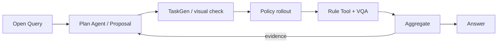

# MEA method evidence: `eval_20260730_batch31_grab_roller_broad_live_v3`

> 当前最新的可发布方法运行；后续 native-runtime 尝试（含 SmolVLA v5）均未产生 policy observation/episode，不替换本证据。完整 raw telemetry 保留在服务器 evaluation 目录。

## 运行范围

- Published commit: `4cb352b8acb62d271bb0718f504eafd7d5e4e229`
- Query: “这个 ACT 策略在 `grab_roller` 任务中最先会在哪种可执行物体属性或场景变化上暴露弱点？”
- Policy / task / checkpoint: `ACT` / `grab_roller` / `act-grab_roller/demo_clean-50`
- Seed / N: `100401` / `N=3` policy episodes（每轮 `N=1`，同一 seed）
- Round budget: `3`
- Final state: `stopped_after_round_3_budget_exhausted`
- Query interpretation: [prompt](artifacts/plan/query_interpretation_prompt.md) · [response](artifacts/plan/query_interpretation_response_1.txt) · [structured result](artifacts/plan/query_interpretation.json)

## 方法数据流

- Round 1 的 control evidence 触发新的尺度 sub-aspect；Round 2 的不充分证据又触发更强尺度与另一侧观测。
- 两次生成任务均通过 fixture、视觉和 expert gate；最终因预算而非证据充分停止。

## Round 1 — official baseline

- Proposal：先确认未扰动任务能执行；TaskGen：`official_passthrough`；rollout：成功 `1/1`。
- Tool：复用 `official_check_success=true`；VQA：`passed`、无冲突；Aggregate：`passed`。
- Plan decision：证据不足以定位弱点，`continue → switch_concern`，下一轮测试可执行的物体尺度变化。
- Artifacts: [VariantSpec](data/round_1_variant_spec.json) · [render](assets/round_1_scene.png) · [video](assets/round_1_act.mp4) · [Tool](artifacts/tool/round_1/tool_execution.json) · [VQA](artifacts/vqa/round_1.json) · [Aggregate](artifacts/aggregate/round_1.json) · [decision](artifacts/plan/decisions/after_round_1.json)
- Next-step trace: [prompt](artifacts/plan/plan_agent_steps/after_round_01/prompt.md) · [response](artifacts/plan/plan_agent_steps/after_round_01/response_1.txt) · [bound Proposal](artifacts/plan/plan_agent_steps/after_round_01/bound_semantic_step.json)

## Round 2 — roller scale `0.85`

- Proposal：缩小可抓取 roller 以降低双臂抓取几何容错；TaskGen：provider 生成 scene/checker，首次生成通过 `2/2` fixtures、visual 和 expert gates。
- Rollout：官方成功 `1/1`；Tool：生成 `query_left_tcp_to_roller_left_contact_min_distance=0.022060869 m`；VQA：`passed`、无冲突；Aggregate：`passed`。
- Plan decision：单侧距离与成功样本仍不足以定位边界，`continue → switch_concern`，细化到 `0.70` 并补另一侧观测。
- Generation: [Proposal](artifacts/taskgen/round_2/generation/proposal.json) · [prompt](artifacts/taskgen/round_2/generation/code_prompt.md) · [response](artifacts/taskgen/round_2/generation/provider_response.txt) · [task code](code/round_2_task.py)
- Validation: [checker fixtures](artifacts/taskgen/round_2/validation/checker_fixtures.json) · [visual result](artifacts/taskgen/round_2/validation/vision.json) · [visual prompt](artifacts/taskgen/round_2/validation/vision_prompt.md) · [expert gate](artifacts/taskgen/round_2/validation/expert_preflight.json)
- Evidence: [render](assets/round_2_scene.png) · [scene comparison](artifacts/taskgen/round_2/evidence/scene_comparison.png) · [video](assets/round_2_act.mp4) · [Tool code](code/round_2_tool.py) · [Tool result](artifacts/tool/round_2/tool_execution.json) · [VQA](artifacts/vqa/round_2.json) · [Aggregate](artifacts/aggregate/round_2.json) · [decision](artifacts/plan/decisions/after_round_2.json)
- Next-step trace: [prompt](artifacts/plan/plan_agent_steps/after_round_02/prompt.md) · [response](artifacts/plan/plan_agent_steps/after_round_02/response_1.txt) · [bound Proposal](artifacts/plan/plan_agent_steps/after_round_02/bound_semantic_step.json)

## Round 3 — roller scale `0.70`

- Proposal：进一步缩小同一物体属性；TaskGen：provider 生成 scene/checker，首次生成通过 `2/2` fixtures、visual 和 expert gates。
- Rollout：官方成功 `1/1`；Tool：生成 `query_right_tcp_to_roller_right_contact_min_distance=0.046543039 m`；VQA：`passed`、无冲突；Aggregate：`passed`。
- Plan decision：`stop`；QueryContract 判定 `evidence_sufficient=false`、`claim_verdict=inconclusive`、`stop_reason=budget_exhausted`。
- Generation: [Proposal](artifacts/taskgen/round_3/generation/proposal.json) · [prompt](artifacts/taskgen/round_3/generation/code_prompt.md) · [response](artifacts/taskgen/round_3/generation/provider_response.txt) · [task code](code/round_3_task.py)
- Validation: [checker fixtures](artifacts/taskgen/round_3/validation/checker_fixtures.json) · [visual result](artifacts/taskgen/round_3/validation/vision.json) · [visual prompt](artifacts/taskgen/round_3/validation/vision_prompt.md) · [expert gate](artifacts/taskgen/round_3/validation/expert_preflight.json)
- Evidence: [render](assets/round_3_scene.png) · [scene comparison](artifacts/taskgen/round_3/evidence/scene_comparison.png) · [video](assets/round_3_act.mp4) · [Tool code](code/round_3_tool.py) · [Tool result](artifacts/tool/round_3/tool_execution.json) · [VQA](artifacts/vqa/round_3.json) · [Aggregate](artifacts/aggregate/round_3.json) · [decision](artifacts/plan/decisions/after_round_3.json)

## 最终 Answer

> 目前无法确定 ACT 最先在哪种物体属性或场景变化上暴露弱点。基线、roller 缩小至原尺度 `0.85`、以及缩小至 `0.70` 的测试均通过官方成功检查；因此在本次已测试范围内尚未观察到任务失败，结论为不确定。

- Stop/verdict: `budget_exhausted` / `inconclusive`；不是 evidence-sufficient stop。
- Findings: 三轮均 `1/1` 通过；执行链无证据冲突；没有观测到“最早弱点”。
- Limitation: 仅 `N=3` 且使用同一 seed；候选空间未封闭，不能推出最坏情况或一般化结论。
- Limitation: 两个 Query-derived candidate 的 preservation 与 required-observation 覆盖仍不完整，不能将结果视为原始扰动意图的决定性证据。
- Next: 完整验证尺度扰动与双侧观测后，以多个新 seed 做更细尺度扫描，再用首次失败尺度回答 Query。
- Answer artifacts: [answer](artifacts/answer/answer.json) · [query answer](artifacts/answer/query_answer.json) · [final Aggregate](artifacts/aggregate/final.json) · [semantic re-audit](artifacts/audit/semantic_alignment_reaudit.json)

## 证据边界

- Policy 成功与 pipeline gate 分开报告；expert gate 只验证可解性/仪器链，不代表被评策略性能。
- 每轮 `N=1` 只证明方法接线；post-run re-audit 使用缓存证据、启动 `0` 个新 rollout，不增加性能证据。
- 本 README 只做人工可读索引；字段真值见 [run_summary.json](run_summary.json)，文件完整性见 [evidence_bundle_manifest.json](evidence_bundle_manifest.json)。
- Raw source: server `mea/evaluation_runs/eval_20260730_batch31_grab_roller_broad_live_v3`。
