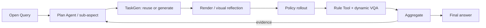
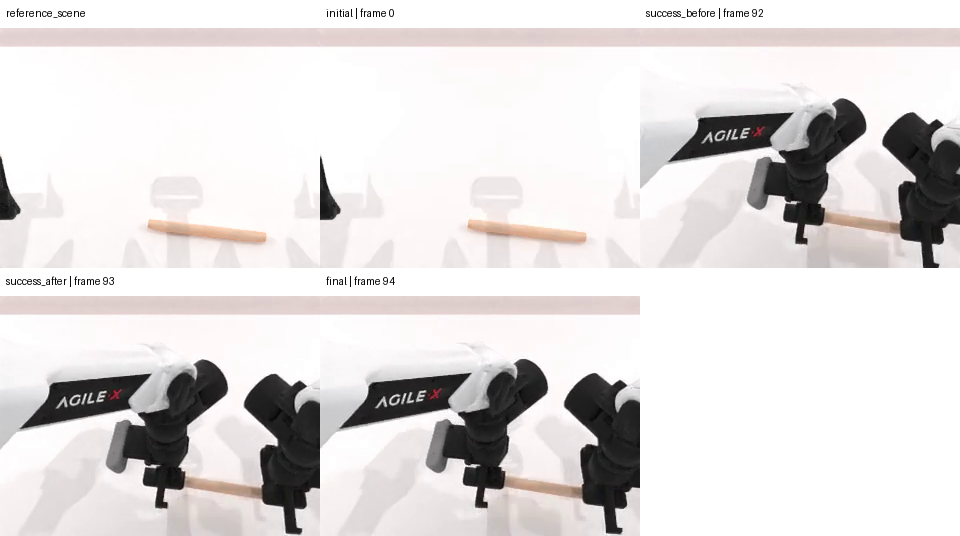

# MEA method evidence: eval_20260731_batch32_clean_flagship_live_v18

> Compact, movable view of one real method run. Complete raw telemetry and Aggregate payloads remain in the server evaluation directory.

## 1. Query and execution scope

> Relative to the official grab task, does there exist a newly generated executable scene challenge that exposes a terminal alignment weakness in this policy? After observing official-control evidence, let the Plan Agent choose the most informative supported scene change without an aspect or template from me. To avoid a trivial perturbation, the chosen geometric scene change must displace the manipulated roller by at least 0.05 m while remaining expert-solvable; the Plan Agent chooses the axis and exact magnitude. Define experimental success as the official task goal AND both terminal TCPs being within 0.025 m of their corresponding roller contact points, using only current simulator point positions; do not require episode history, accumulated contact, or a trajectory-derived success threshold. Independently report one scalar metric computed from the rollout trajectory that diagnoses the chosen hypothesis, but treat that scalar strictly as diagnostic evidence and never as the terminal success outcome.

- Task: `grab_roller`
- Policy: `SmolVLA`
- Checkpoint: `lerobot/smolvla_robotwin`
- Round budget / episodes: `3` / `[1, 1]`

## 2. Paper-level data flow

## 3. Plan Agent trace

- Goal: answer_open_query_with_evidence: Relative to the official grab task, does there exist a newly generated executable scene challenge that exposes a terminal alignment weakness in this policy? After observing official-control evidence, let the Plan Agent choose the most informative supported scene change without an aspect or template from me. To avoid a trivial perturbation, the chosen geometric scene change must displace the manipulated roller by at least 0.05 m while remaining expert-solvable; the Plan Agent chooses the axis and exact magnitude. Define experimental success as the official task goal AND both terminal TCPs being within 0.025 m of their corresponding roller contact points, using only current simulator point positions; do not require episode history, accumulated contact, or a trajectory-derived success threshold. Independently report one scalar metric computed from the rollout trajectory that diagnoses the chosen hypothesis, but treat that scalar strictly as diagnostic evidence and never as the terminal success outcome.
- Initial round: `round_1`
- Final planning state: `stopped_after_round_2`
- Query interpretation trace: [prompt](artifacts/plan/query_interpretation_prompt.md) / [response 1](artifacts/plan/query_interpretation_response_1.txt)

## 4.1. `round_1` — task_execution.official_baseline

### Plan → TaskGen

- Task: `grab_roller`
- Route/materialization: `official` / `official_passthrough`
- Gates: {"generation_attempts": null, "checker_fixtures": null, "vision_passed": null, "expert_passed": null}
- Generated/reused source: N/A (artifact was not present)

### Render / scene check

N/A - no real scene image was found.

### Rollout

- Backend/seeds: `SmolVLA` / `[100401]`
- Pipeline/policy success: `True` / `1.0`

[Open policy video](assets/round_1_act.mp4)

<video src="assets/round_1_act.mp4" controls width="720"></video>

### Tool / VQA

- Tool: `reuse` → `official_check_success`
- Values: [{"role": "policy_under_evaluation", "policy_name": "SmolVLA", "seed": 100401, "value": true, "unit": null, "passed": true}]
- VQA status: `None`; conflict: `None`

### Aggregate -> next decision

- Aggregate: {"status": "passed", "source_count": 1, "episode_result_count": 1, "unique_episode_count": 1, "metric_ids": ["official_check_success"], "input_issue_count": 0}
- Decision: {"action": "continue", "transition": "switch_concern", "decision_reason": "provider_authored_open_world_step", "observation_summary": "The official unchanged-scene control succeeded, so baseline task execution is not the remaining uncertainty. The next most informative test is the smallest permitted geometric displacement, exactly 0.05 m along one supported position axis, while preserving expert solvability. The checker directly tests the requested terminal alignment conjunction, and the separate rollout-peak distance diagnoses transient alignment weakness without replacing the terminal success verdict.", "answered_query": false, "evidence_sufficient": null, "claim_verdict": null, "stop_reason": null}

## 4.2. `round_2` — scene_robustness.roller_translation.terminal_tcp_alignment

### Plan → TaskGen

- Task: `grab_roller`
- Route/materialization: `generic_provider_scene_checker_codegen` / `generic_provider_scene_checker_codegen`
- Gates: {"generation_attempts": 2, "checker_fixtures": "2/2", "vision_passed": true, "expert_passed": true}
- Proposal: [proposal.json](artifacts/taskgen/round_2/generation/proposal.json)
- Provider trace: [prompt](artifacts/taskgen/round_2/generation/code_prompt.md) / [response](artifacts/taskgen/round_2/generation/provider_response.txt)
- Task artifact: [round_2_task.py](code/round_2_task.py)

### Render / scene check

### Rollout

- Backend/seeds: `SmolVLA` / `[100401]`
- Pipeline/policy success: `True` / `0.0`

[Open policy video](assets/round_2_act.mp4)

<video src="assets/round_2_act.mp4" controls width="720"></video>

### Tool / VQA

- Tool: `provider_python_codegen` → `terminal_max_tcp_contact_distance`
- Values: [{"role": "policy_under_evaluation", "policy_name": "SmolVLA", "seed": 100401, "value": 0.24384725093841553, "unit": "m", "passed": null}]
- [Open generated/reused Tool source](code/round_2_tool.py)
- VQA status: `passed`; conflict: `False`

### Aggregate -> next decision

- Aggregate: {"status": "passed", "source_count": 2, "episode_result_count": 2, "unique_episode_count": 2, "metric_ids": ["generated_check_success", "terminal_max_tcp_contact_distance"], "input_issue_count": 0}
- Decision: {"action": "stop", "transition": "stop", "decision_reason": "provider_authored_open_world_step", "observation_summary": "The official-scene control succeeded, while the bounded 0.05 m roller translation produced a sufficient experimental failure under the required official-goal-and-terminal-alignment predicate. This answers the existence question; the trajectory-independent terminal diagnostic also showed a 0.24384725093841553 m maximum TCP-to-contact distance.", "answered_query": true, "evidence_sufficient": null, "claim_verdict": null, "stop_reason": null}

## 5. Final answer to the original Query

> 是。在 grab_roller 任务中，Plan Agent 选择将 roller 沿世界 x 轴平移 0.05 m，并验证该场景可由专家解决。官方未改变场景控制成功；但在平移场景中，SmolVLA 未完成由官方目标与两个 terminal TCP-接触点距离均不超过 0.025 m 组成的实验谓词。因此，在本次有限实验范围内发现了 terminal alignment weakness。

- Finding: 官方未改变场景中，官方检查成功率为 1/1。
- Finding: 0.05 m 世界 x 轴 roller 平移场景通过了场景生成、执行、专家可解性及工具验证。
- Finding: 平移场景中，官方核心谓词仍满足，但组合实验检查失败，策略成功率为 0/1；因此策略未完成该实验任务。
- Finding: terminal 最大 TCP-to-contact 距离为 0.24384725093841553 m，明显超过 0.025 m 阈值。
- Finding: 执行 VQA 无证据冲突，并在 final 帧定性观察到左 TCP 看起来比右 TCP 更远离对应接触点；该观察仅为支持性视觉证据。
- Next: 在保持同一官方谓词和 terminal 0.025 m 阈值的前提下，使用至少多个新的独立种子重复该 0.05 m 世界 x 轴平移场景，并从 rollout telemetry 明确输出轨迹峰值 TCP-to-contact 距离，分别与 terminal 距离及官方检查结果对照。
- Limitation: 结论仅适用于本次任务、checkpoint、0.05 m 世界 x 轴平移候选及种子 100401。
- Limitation: N=2 且只有一个唯一种子 [100401]，不是统计泛化保证。
- Limitation: 候选域开放，未测试其他场景变化，不能推出穷尽性、最坏情况或普遍鲁棒性结论。
- Limitation: generated_check_success 不是官方 benchmark success；本次失败表示有界实验谓词失败，而非官方检查失败。
- Limitation: 证据中未提供所要求的轨迹峰值标量的数值；0.24384725093841553 m 是 terminal 诊断值，不能改写为轨迹峰值。
- Limitation: Evidence contains N=2 policy episodes at seeds [100401].
- Limitation: The run stopped because the finite query-sufficiency contract was satisfied; this is not a statistical generalization guarantee.
## 6. Boundaries

- Policy results and pipeline status are reported separately.
- Expert evidence, when present, is a solvability/instrumentation gate, not evaluated-policy performance.
- Few-shot N=1 rounds demonstrate method wiring, not benchmark-level generalization.
- Missing artifacts are shown as N/A; this report never substitutes proxy images or invented values.

## 7. Artifact index

- [Compact machine summary](run_summary.json)
- [Published-file inventory with bytes and SHA-256](evidence_bundle_manifest.json)
- Complete raw source remains server-side at `mea/evaluation_runs/eval_20260731_batch32_clean_flagship_live_v18`.

### Completed-round Tool reuse audit

{"repair_id": "independent_query_tool_reuse_v1", "act_rollouts_started": 0, "first_query_route": "provider_python_codegen", "first_query_measurements": [0.24384725093841553], "exact_reuse_route": "run_local_reuse", "exact_reuse_provider_called": false, "aggregate_status": "source_round_passed_not_recomputed", "acceptance_projection": {"status": "completed", "source_summary_path": "summary/summary.json", "projection_source": "current_code_post_run", "artifact": "artifacts/audit/completed_round_reuse/acceptance_projection.json", "accepted": true, "candidate_execution_accepted": true}}
This independent follow-up Query reuses completed policy telemetry and starts no simulator or policy rollout. It proves exact reuse within this evaluation's registry, not cross-evaluation reuse.
