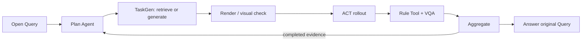

# 当前方法证据：`eval_20260729_b30_refinement_live_v2`

本页是最近一次可审计真实运行的人工可读索引。它只保留 Query、三轮决策链、
关键测量、结论和限制；完整 JSON、provider 输入输出、生成代码、render、视频、
Rule/VQA 和 Aggregate 仍保存在本目录下的链接中。

## 1. Query 与固定执行范围

> Where does this ACT policy first expose a weakness under manipulated-object
> property changes, and what evidence supports that conclusion?

| 项目 | 本次运行 |
| --- | --- |
| Simulator | RoboTwin |
| Base task | `click_bell` |
| Policy | ACT |
| Checkpoint | `act-click_bell/demo_clean-50` |
| Scene seed | `100000` |
| 最大轮数 | 3 |
| 每轮 policy episode | 1 |
| 总 policy episodes | 3 |
| History/cache rollout replay | 禁用 |
| 最终 Planner 状态 | `evidence_sufficient` |
| Flagship acceptance | `true` |

同一次 evaluation 始终固定 task、policy checkpoint 和 seed。Planner 只能改变要检查的
sub-aspect，以及为该 sub-aspect 生成或复用的 Task/Tool。

- 原始请求：[request.json](artifacts/query/request.json)
- 全局路由：[global_query_route.json](artifacts/plan/global_query_route.json)
- 无预设 aspect 的 FreeConcern：
  [结果](artifacts/plan/free_concern.json) /
  [prompt](artifacts/plan/free_concern_prompt.md) /
  [response](artifacts/plan/free_concern_response_1.txt)
- Query 充分性合同：
  [query_sufficiency_contract.json](artifacts/plan/query_sufficiency_contract.json)
- 初始计划：[evaluation_plan.json](artifacts/plan/evaluation_plan.json)
- 完整 session：[bound_task_session.json](artifacts/plan/bound_task_session.json)

## 2. 论文方法数据流



本例最重要的证据不是“跑了三轮”，而是后两轮 sub-aspect 都在上一轮完成后才产生：

1. 首轮只运行 official control，没有预冻结 position/instance 候选。
2. Round 1 evidence 进入 Planner 后，Planner 才提出 position variation。
3. Round 2 evidence 进入 Planner 后，Planner 再提出 instance variation。
4. Round 3 出现 official failure 后，QueryContract 返回
   `evidence_sufficient` 并停止。

## 3. 三轮摘要

| Round | evidence 后选择的 concern | Task | Official success | Rule Tool | VQA | 下一步 |
| --- | --- | --- | ---: | --- | --- | --- |
| 1 | official control | official passthrough | 1/1 | official success=true | 可见按铃 | position |
| 2 | object position | provider scene，official checker | 1/1 | 新 metric=`0.021466 m` | 可见按铃 | instance |
| 3 | object instance label | provider scene，official checker | 0/1 | exact run-local reuse=`0.002753 m` | 未见按铃 | stop |

### 3.1 Round 1：official control

Round 1 没有生成新 scene 或 checker，只验证固定 ACT checkpoint 在 official
`click_bell` 上可执行并成功。

- Child run：`run_20260729_b30_refinement_live_v2_round_1`
- Task route：`official` / `official_passthrough`
- ACT：seed `100000`，official success `true`
- VQA：观察到机器人按下目标 bell；Rule 与 VQA 无冲突
- Aggregate：`passed`

证据：

- [Task manifest](artifacts/taskgen/round_1/manifest.json)
- [Static validation](artifacts/taskgen/round_1/validation/static.json)
- [Scene](assets/round_1_scene.png)
- [ACT video](assets/round_1_act.mp4)
- [VQA montage](assets/round_1_vqa_montage.png)
- [Tool request](artifacts/tool/round_1/tool_request.json)
- [Tool execution](artifacts/tool/round_1/tool_execution.json)
- [VQA result](artifacts/vqa/round_1.json)
- [Round aggregate](artifacts/aggregate/round_1.json)

Round 1 完成后，Planner 读取 `round_1` evidence，提出
`task_execution.object_position_variation`。其 lineage 明确记录
`completed_round_ids=["round_1"]`，不是 control 前冻结的脚本分支。

- [Evidence supplied to Planner](artifacts/plan/claim_first_runtime/evidence_after_round_01.json)
- [Planner prompt](artifacts/plan/claim_first_steps/after_round_01/prompt.md)
- [Provider response](artifacts/plan/claim_first_steps/after_round_01/response_1.txt)
- [Bound semantic step](artifacts/plan/claim_first_steps/after_round_01/bound_semantic_step.json)
- [Decision after round 1](artifacts/plan/decisions/after_round_1.json)

### 3.2 Round 2：position variation

Planner 请求一个有界位置变化、复用 official checker，并要求一个数值 Rule Tool。
TaskGen 生成薄 subclass，在 official bell 初始 pose 上加入最多约 `±0.02 m`
的三维位置扰动。

- Child run：`run_20260729_b30_refinement_live_v2_round_2`
- Task route：`generic_provider_scene_checker_codegen`
- Checker：未生成；直接复用 official `check_success()`
- ACT：seed `100000`，official success `true`
- VQA：观察到机器人按下 bell；Rule 与 VQA 无冲突
- Aggregate：`passed`

Task/视觉证据：

- [Generated task.py](code/round_2_task.py)
- [ExperimentCandidate](artifacts/taskgen/round_2/generation/experiment_candidate.json)
- [Codegen prompt](artifacts/taskgen/round_2/generation/code_prompt.md)
- [Provider response](artifacts/taskgen/round_2/generation/provider_response.txt)
- [Implementation trace](artifacts/taskgen/round_2/validation/implementation_trace.json)
- [Setup preflight](artifacts/taskgen/round_2/validation/setup_preflight.json)
- [Expert preflight](artifacts/taskgen/round_2/validation/expert_preflight.json)
- [Vision result](artifacts/taskgen/round_2/validation/vision.json)
- [Vision prompt](artifacts/taskgen/round_2/validation/vision_prompt.md)
- [Scene comparison](artifacts/taskgen/round_2/evidence/scene_comparison.png)
- [Scene](assets/round_2_scene.png)
- [ACT video](assets/round_2_act.mp4)
- [VQA montage](assets/round_2_vqa_montage.png)

Query 诱发的 Tool 使用 typed MetricSpec，计算
`right_tcp_position` 与 `bell_contact_position` 的最小 XY 距离：

- Route：`typed_metric_spec_compile`
- 测量值：`0.021466496280102353 m`
- 测量有效并进入 Aggregate/Planner

Tool/决策证据：

- [Generated Tool](code/round_2_tool.py)
- [MetricSpec execution](artifacts/tool/round_2/metric_spec_execution.json)
- [Resolved Tool spec](artifacts/tool/round_2/resolved_tool_spec.json)
- [Tool execution](artifacts/tool/round_2/tool_execution.json)
- [VQA result](artifacts/vqa/round_2.json)
- [Round aggregate](artifacts/aggregate/round_2.json)
- [Evidence supplied to Planner](artifacts/plan/claim_first_runtime/evidence_after_round_02.json)
- [Planner prompt](artifacts/plan/claim_first_steps/after_round_02/prompt.md)
- [Provider response](artifacts/plan/claim_first_steps/after_round_02/response_1.txt)
- [Bound semantic step](artifacts/plan/claim_first_steps/after_round_02/bound_semantic_step.json)
- [Decision after round 2](artifacts/plan/decisions/after_round_2.json)

看到 position variant 仍成功后，Planner 才转向
`task_execution.object_instance_variation`，lineage 同时包含 `round_1` 和
`round_2`。

### 3.3 Round 3：materialized scaled-instance variant

Round 3 的 Planner 标签是 `object_instance_variation`；实际生成代码保留随机
bell model id，并添加 `scale_multiplier=1.2`。因此本轮直接证明的是**这个具体
放大 20% 的 materialized variant 失败**，不能把它扩张成所有 object instance
变化都会失败。

- Child run：`run_20260729_b30_refinement_live_v2_round_3`
- Task route：`generic_provider_scene_checker_codegen`
- Checker：未生成；复用 official `check_success()`
- ACT：seed `100000`，official success `false`
- VQA：未观察到按铃；与 official failure 一致
- Aggregate：`passed`，表示证据管线合法，不表示 policy 成功

Task/视觉证据：

- [Generated task.py](code/round_3_task.py)
- [ExperimentCandidate](artifacts/taskgen/round_3/generation/experiment_candidate.json)
- [Codegen prompt](artifacts/taskgen/round_3/generation/code_prompt.md)
- [Provider response](artifacts/taskgen/round_3/generation/provider_response.txt)
- [Implementation trace](artifacts/taskgen/round_3/validation/implementation_trace.json)
- [Setup preflight](artifacts/taskgen/round_3/validation/setup_preflight.json)
- [Expert preflight](artifacts/taskgen/round_3/validation/expert_preflight.json)
- [Vision result](artifacts/taskgen/round_3/validation/vision.json)
- [Scene comparison](artifacts/taskgen/round_3/evidence/scene_comparison.png)
- [Scene](assets/round_3_scene.png)
- [ACT video](assets/round_3_act.mp4)
- [VQA montage](assets/round_3_vqa_montage.png)

Round 3 按相同 MetricSpec/code identity 走 `run_local_reuse`：

- 测量值：`0.0027531830083962435 m`
- 该 metric 表示最近 XY 距离，不是 success predicate
- 因此“小距离”与“未按响 bell”并不冲突

- [MetricSpec execution](artifacts/tool/round_3/metric_spec_execution.json)
- [Resolved Tool spec](artifacts/tool/round_3/resolved_tool_spec.json)
- [Reuse route](artifacts/tool/round_3/route_decision.json)
- [Tool execution](artifacts/tool/round_3/tool_execution.json)
- [VQA result](artifacts/vqa/round_3.json)
- [Round aggregate](artifacts/aggregate/round_3.json)
- [Final evidence assessment](artifacts/plan/claim_first_runtime/evidence_after_round_03.json)
- [Decision after round 3](artifacts/plan/decisions/after_round_3.json)

## 4. 对原 Query 的回答

本次有限诊断域中，ACT 在 official control 和位置扰动中成功，首次观察到的失败是
Round 3 的 1.2× scaled bell variant。official checker、VQA 和 rollout video
共同支持“该 materialized variant 未完成按铃”。

- [Structured answer](artifacts/answer/query_answer.json)
- [Feedback / acceptance](artifacts/answer/feedback.json)
- [Full generated report](artifacts/answer/evaluation_report.md)
- [Final deterministic aggregate](artifacts/aggregate/final.json)

## 5. 可以声称与不能声称

可以声称：

- 一个未给 aspect/template 的 Query 完成了真实三轮闭环。
- Round 1 evidence 后才产生 position concern；Round 2 evidence 后才产生下一 concern。
- 同一 bundle 内完成 scene generation、official checker reuse、ACT、Rule/VQA、
  Aggregate、Planner 和最终回答。
- Query 诱发的新 Tool 得到非空 live 值，并在下一轮 exact run-local reuse。
- deterministic QueryContract 的停止原因是 `evidence_sufficient`。

不能声称：

- N=3、单 task、单 checkpoint、单 seed 能建立统计泛化结论。
- 开放 candidate universe 已穷尽，或已经证明 worst-case/no-counterexample。
- Round 3 覆盖所有 object instance 变化；实际代码只验证一个 1.2× scale variant。
- 本例证明了新 checker codegen；两轮生成场景都复用了 official checker。
- 本例证明了采样节省。停止时预算也已耗尽，因此没有 early-stop saving。
- run-local reuse 等同于第二个独立 Query 从 reviewed registry 跨 evaluation 复用。
- Planner 给出的诊断文字本身构成独立因果证明。

## 6. 原始证据入口

公开 compact bundle：

- [Bundle manifest](evidence_bundle_manifest.json)
- [Source manifest](artifacts/audit/source_manifest.json)
- [Machine evidence bundle](artifacts/audit/evidence_bundle.json)
- [Audit summary](artifacts/audit/summary.json)
- [Round data](data/)
- [Generated code](code/)
- [Render、VQA montage 与视频](assets/)

canonical server 上的完整原始运行位于：

```text
mea/evaluation_runs/eval_20260729_b30_refinement_live_v2/
mea/generated_tasks/run_20260729_b30_refinement_live_v2_round_1/
mea/generated_tasks/run_20260729_b30_refinement_live_v2_round_2/
mea/generated_tasks/run_20260729_b30_refinement_live_v2_round_3/
```

Git 仅保存当前运行的紧凑、可审计投影；完整 telemetry、全部关键帧和其他中间缓存
继续保留在 canonical server。
