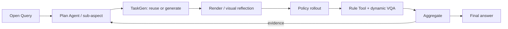

# MEA method evidence: eval_20260730_b44_grab_roller_plan_agent_live13

> Compact, movable view of one real method run. Complete raw telemetry and Aggregate payloads remain in the server evaluation directory.

## 1. Query and execution scope

> 只回答这个有界候选：当一个与目标滚筒外观相同、可物理交互的非目标滚筒比目标更靠近机器人时，是否存在一个成功样本？把本候选的实验成功定义为目标滚筒最终高度不低于0.8米且非目标滚筒最终高度低于0.8米；同时报告两者最终高度之差。完成 official control 与这一候选后即可停止。

- Task: `grab_roller`
- Policy: `ACT`
- Checkpoint: `act-grab_roller/demo_clean-50`
- Round budget / episodes: `2` / `[1, 1]`

## 2. Paper-level data flow

## 3. Plan Agent trace

- Goal: answer_open_query_with_evidence: 只回答这个有界候选：当一个与目标滚筒外观相同、可物理交互的非目标滚筒比目标更靠近机器人时，是否存在一个成功样本？把本候选的实验成功定义为目标滚筒最终高度不低于0.8米且非目标滚筒最终高度低于0.8米；同时报告两者最终高度之差。完成 official control 与这一候选后即可停止。
- Initial round: `round_1`
- Final planning state: `stopped_after_round_2_evidence_sufficient`
- Query interpretation trace: [prompt](artifacts/plan/query_interpretation_prompt.md) / [response 1](artifacts/plan/query_interpretation_response_1.txt) / [response 2](artifacts/plan/query_interpretation_response_2.txt)

## 4.1. `round_1` — task_execution.official_baseline

### Plan → TaskGen

- Task: `grab_roller`
- Route/materialization: `official` / `official_passthrough`
- Gates: {"generation_attempts": null, "checker_fixtures": null, "vision_passed": null, "expert_passed": null}
- Generated/reused source: N/A (artifact was not present)
- VariantSpec: [round_1_variant_spec.json](data/round_1_variant_spec.json)

### Render / scene check

### Rollout

- Backend/seeds: `ACT` / `[100301]`
- Pipeline/policy success: `True` / `1.0`

[Open policy video](assets/round_1_act.mp4)

<video src="assets/round_1_act.mp4" controls width="720"></video>

### Tool / VQA

- Tool: `reuse` → `official_check_success`
- Values: [{"role": "policy_under_evaluation", "policy_name": "ACT", "seed": 100301, "value": true, "unit": null, "passed": true}]
- VQA status: `passed`; conflict: `False`

### Aggregate -> next decision

- Aggregate: {"status": "passed", "source_count": 1, "episode_result_count": 2, "unique_episode_count": 1, "metric_ids": ["official_check_success", "time_to_success"], "input_issue_count": 0}
- Decision: {"action": "continue", "transition": "switch_concern", "decision_reason": "provider_authored_open_world_step", "observation_summary": "This test isolates the effect of the non-target roller's proximity on the policy's ability to achieve the success conditions defined in the Query. It directly addresses the Query's core uncertainty by introducing a controlled perturbation to the scene.", "answered_query": false, "evidence_sufficient": null, "claim_verdict": null, "stop_reason": null}

## 4.2. `round_2` — task_execution.non_target_proximity_effect

### Plan → TaskGen

- Task: `grab_roller`
- Route/materialization: `generic_provider_scene_checker_codegen` / `generic_provider_scene_checker_codegen`
- Gates: {"generation_attempts": 1, "checker_fixtures": "2/2", "vision_passed": true, "expert_passed": true}
- Proposal: [proposal.json](artifacts/taskgen/round_2/generation/proposal.json)
- Provider trace: [prompt](artifacts/taskgen/round_2/generation/code_prompt.md) / [response](artifacts/taskgen/round_2/generation/provider_response.txt)
- Task artifact: [round_2_task.py](code/round_2_task.py)

### Render / scene check

### Rollout

- Backend/seeds: `ACT` / `[100301]`
- Pipeline/policy success: `True` / `1.0`

[Open policy video](assets/round_2_act.mp4)

<video src="assets/round_2_act.mp4" controls width="720"></video>

### Tool / VQA

- Tool: `typed_metric_spec_compile` → `query_derived_metric`
- Values: [{"role": "policy_under_evaluation", "policy_name": "ACT", "seed": 100301, "value": 0.05838477611541748, "unit": "m", "passed": null}]
- [Open generated/reused Tool source](code/round_2_tool.py)
- VQA status: `passed`; conflict: `False`

### Aggregate -> next decision

- Aggregate: {"status": "passed", "source_count": 2, "episode_result_count": 2, "unique_episode_count": 2, "metric_ids": ["generated_check_success", "query_derived_metric"], "input_issue_count": 0}
- Decision: {"action": "stop", "transition": "stop", "decision_reason": "plan_agent_evidence_sufficiency", "observation_summary": "A definitive pass candidate witnesses the existential claim.", "answered_query": true, "evidence_sufficient": true, "claim_verdict": "supported", "stop_reason": "evidence_sufficient"}

## 5. Final answer to the original Query

> 是的，存在一个成功样本。

- Finding: 目标滚筒的最终高度不低于0.8米，非目标滚筒的最终高度低于0.8米。
- Finding: 目标滚筒与非目标滚筒的最终高度差为0.0584米。
- Next: 若需更广泛的结论，建议增加样本数量并进行多种场景的测试。
- Limitation: 证据包含2个样本，种子为[100301]。
- Limitation: 本次评估基于有限域的查询充分性协议，不能作为统计泛化的保证。
- Limitation: 至少一个候选项的结论基于生成的检查器，不能视为官方基准的成功结果。
- Limitation: 生成的检查器尚未被认证为与官方核心谓词等效，其结论应视为实验性。
- Limitation: Evidence contains N=2 policy episodes at seeds [100301].
- Limitation: The run stopped because the finite query-sufficiency contract was satisfied; this is not a statistical generalization guarantee.
## 6. Boundaries

- Policy results and pipeline status are reported separately.
- Expert evidence, when present, is a solvability/instrumentation gate, not evaluated-policy performance.
- Few-shot N=1 rounds demonstrate method wiring, not benchmark-level generalization.
- Missing artifacts are shown as N/A; this report never substitutes proxy images or invented values.

## 7. Artifact index

- [Compact machine summary](run_summary.json)
- [Published-file inventory with bytes and SHA-256](evidence_bundle_manifest.json)
- Complete raw source remains server-side at `mea/evaluation_runs/eval_20260730_b44_grab_roller_plan_agent_live13`.

### Completed-round Tool reuse audit

{"repair_id": "live14_provider_python_toolgen_v1", "act_rollouts_started": 0, "first_query_route": "provider_python_codegen", "first_query_measurements": [{"tool": "query_derived_metric", "version": 1, "generated": true, "tool_sha256": "60522ca8d1bc2f57a1f9de6dc01509196cff49ca67dfbd986a4d7f1a350ad96d", "value": 0.05838477611541748, "unit": "m", "passed": null, "evidence_steps": [7821], "details": {"operation": "terminal_signal_difference", "reason": "measured"}}], "exact_reuse_route": "run_local_reuse", "exact_reuse_provider_called": false, "aggregate_status": "not_recomputed"}
This audit reuses completed policy telemetry and starts no simulator or policy rollout. It proves exact run-local reuse, not independent cross-evaluation reuse.
