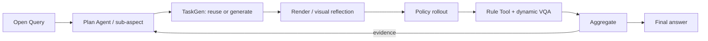
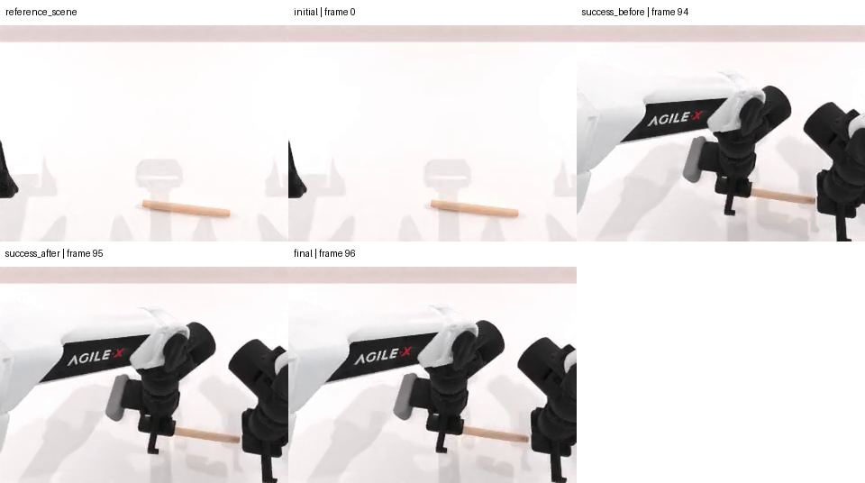

# MEA method evidence: eval_20260730_batch31_grab_roller_broad_live_v3

> Compact, movable view of one real method run. Complete raw telemetry and Aggregate payloads remain in the server evaluation directory.

## 1. Query and execution scope

> 这个ACT策略在grab_roller任务中最先会在哪种可执行物体属性或场景变化上暴露弱点？

- Task: `grab_roller`
- Policy: `ACT`
- Checkpoint: `act-grab_roller/demo_clean-50`
- Round budget / episodes: `3` / `[1, 1, 1]`

## 2. Paper-level data flow

## 3. Plan Agent trace

- Goal: answer_open_query_with_evidence: 这个ACT策略在grab_roller任务中最先会在哪种可执行物体属性或场景变化上暴露弱点？
- Initial round: `round_1`
- Final planning state: `stopped_after_round_3_budget_exhausted`
- Query interpretation trace: [prompt](artifacts/plan/query_interpretation_prompt.md) / [response 1](artifacts/plan/query_interpretation_response_1.txt)

## 4.1. `round_1` — task_execution.official_baseline

### Plan → TaskGen

- Task: `grab_roller`
- Route/materialization: `official` / `official_passthrough`
- Gates: {"generation_attempts": null, "checker_fixtures": null, "vision_passed": null, "expert_passed": null}
- Generated/reused source: N/A (artifact was not present)
- VariantSpec: [round_1_variant_spec.json](data/round_1_variant_spec.json)

### Render / scene check

### Rollout

- Backend/seeds: `ACT` / `[100401]`
- Pipeline/policy success: `True` / `1.0`

[Open policy video](assets/round_1_act.mp4)

<video src="assets/round_1_act.mp4" controls width="720"></video>

### Tool / VQA

- Tool: `reuse` → `official_check_success`
- Values: [{"role": "policy_under_evaluation", "policy_name": "ACT", "seed": 100401, "value": true, "unit": null, "passed": true}]
- VQA status: `passed`; conflict: `False`

### Aggregate -> next decision

- Aggregate: {"status": "passed", "source_count": 1, "episode_result_count": 2, "unique_episode_count": 1, "metric_ids": ["official_check_success", "time_to_success"], "input_issue_count": 0}
- Decision: {"action": "continue", "transition": "switch_concern", "decision_reason": "provider_authored_open_world_step", "observation_summary": "官方未扰动场景已成功，说明当前失败不太可能来自基本任务流程；但仅一轮成功不能回答哪种物体或场景变化最先暴露弱点。尺度缩小直接降低双臂抓取的几何容错，且是load_actors明确支持的物体属性变化，比改变不可用的策略噪声或控制精度更可执行。该单因素扰动可用峰值高度和TCP接触距离诊断失败机制，同时保留官方checker以判断任务是否仍成功。", "answered_query": false, "evidence_sufficient": null, "claim_verdict": null, "stop_reason": null}

## 4.2. `round_2` — object_geometry.graspable_scale_reduction

### Plan → TaskGen

- Task: `grab_roller`
- Route/materialization: `generic_provider_scene_checker_codegen` / `generic_provider_scene_checker_codegen`
- Gates: {"generation_attempts": 1, "checker_fixtures": "2/2", "vision_passed": true, "expert_passed": true}
- Proposal: [proposal.json](artifacts/taskgen/round_2/generation/proposal.json)
- Provider trace: [prompt](artifacts/taskgen/round_2/generation/code_prompt.md) / [response](artifacts/taskgen/round_2/generation/provider_response.txt)
- Task artifact: [round_2_task.py](code/round_2_task.py)

### Render / scene check

### Rollout

- Backend/seeds: `ACT` / `[100401]`
- Pipeline/policy success: `True` / `1.0`

[Open policy video](assets/round_2_act.mp4)

<video src="assets/round_2_act.mp4" controls width="720"></video>

### Tool / VQA

- Tool: `provider_python_codegen` → `query_left_tcp_to_roller_left_contact_min_distance`
- Values: [{"role": "policy_under_evaluation", "policy_name": "ACT", "seed": 100401, "value": 0.02206086926162243, "unit": "m", "passed": null}]
- [Open generated/reused Tool source](code/round_2_tool.py)
- VQA status: `passed`; conflict: `False`

### Aggregate -> next decision

- Aggregate: {"status": "passed", "source_count": 2, "episode_result_count": 3, "unique_episode_count": 2, "metric_ids": ["official_check_success", "query_left_tcp_to_roller_left_contact_min_distance", "time_to_success"], "input_issue_count": 0}
- Decision: {"action": "continue", "transition": "switch_concern", "decision_reason": "provider_authored_open_world_step", "observation_summary": "基线未扰动场景成功率为1.0，但0.85尺度测试仍成功且仅获得单侧22.1毫米距离观测，证据被标记为ambiguous并提示原始意图不完整，无法判断尺度变化是否接近失效边界。因此在保持其他因素不变的前提下，将同一可执行物体属性进一步缩小到0.70是对该不确定性的更具判别力的可观测版本；同时补充双侧距离，避免单侧观测掩盖双臂抓取瓶颈。", "answered_query": false, "evidence_sufficient": null, "claim_verdict": null, "stop_reason": null}

## 4.3. `round_3` — object_geometry.graspable_scale_strong_reduction

### Plan → TaskGen

- Task: `grab_roller`
- Route/materialization: `generic_provider_scene_checker_codegen` / `generic_provider_scene_checker_codegen`
- Gates: {"generation_attempts": 1, "checker_fixtures": "2/2", "vision_passed": true, "expert_passed": true}
- Proposal: [proposal.json](artifacts/taskgen/round_3/generation/proposal.json)
- Provider trace: [prompt](artifacts/taskgen/round_3/generation/code_prompt.md) / [response](artifacts/taskgen/round_3/generation/provider_response.txt)
- Task artifact: [round_3_task.py](code/round_3_task.py)

### Render / scene check

### Rollout

- Backend/seeds: `ACT` / `[100401]`
- Pipeline/policy success: `True` / `1.0`

[Open policy video](assets/round_3_act.mp4)

<video src="assets/round_3_act.mp4" controls width="720"></video>

### Tool / VQA

- Tool: `provider_python_codegen` → `query_right_tcp_to_roller_right_contact_min_distance`
- Values: [{"role": "policy_under_evaluation", "policy_name": "ACT", "seed": 100401, "value": 0.04654303938150406, "unit": "m", "passed": null}]
- [Open generated/reused Tool source](code/round_3_tool.py)
- VQA status: `passed`; conflict: `False`

### Aggregate -> next decision

- Aggregate: {"status": "passed", "source_count": 2, "episode_result_count": 3, "unique_episode_count": 2, "metric_ids": ["official_check_success", "query_right_tcp_to_roller_right_contact_min_distance", "time_to_success"], "input_issue_count": 0}
- Decision: {"action": "stop", "transition": "stop", "decision_reason": "plan_agent_evidence_sufficiency", "observation_summary": "The bounded rollout budget ended before the query sufficiency contract was satisfied.", "answered_query": false, "evidence_sufficient": false, "claim_verdict": "inconclusive", "stop_reason": "budget_exhausted"}

## 5. Final answer to the original Query

> 目前无法确定 ACT 最先在哪种物体属性或场景变化上暴露弱点。基线、roller 缩小至原尺度 0.85、以及缩小至 0.70 的测试均通过官方成功检查；因此在本次已测试范围内尚未观察到任务失败，结论为不确定。

- Finding: 未扰动基线官方成功率为 1/1。
- Finding: roller 缩小至原尺度 0.85 的候选官方成功率为 1/1，未显示任务失败。
- Finding: roller 缩小至原尺度 0.70 的候选官方成功率为 1/1，未显示任务失败。
- Finding: 执行流水线完成且没有报告证据冲突，但查询充分性契约未满足，因此不能据此认定存在已验证的最早弱点。
- Next: 在明确绑定并验证完整 0.85 与 0.70 尺度扰动、保持条件及双侧接触观测后，使用多个新种子进行更细的尺度递减扫描，直到官方成功检查首次失败；再将首次失败尺度与基线比较，以定位最早弱点。
- Limitation: 本次仅有 N=3 个策略 episode，且全部使用种子 [100401]，不是广泛泛化评估。
- Limitation: 评估在预算耗尽前未满足查询充分性契约，结论为 inconclusive。
- Limitation: 两个 Query-derived 候选的原始意图字段均未覆盖，包括 requested_change、preserved_conditions、hypothesis 和 required_observation；因此不能把这些结果当作完整实现原始扰动意图的决定性证据。
- Limitation: 候选空间未封闭，不能推出穷尽性、最坏情况或一般化结论。
- Limitation: Evidence contains N=3 policy episodes at seeds [100401].
- Limitation: Tested Query-derived candidate contract requirements remain uncovered: ['intent.7d4cb852954896a8:requested_change', 'intent.7d4cb852954896a8:preserved_conditions', 'intent.7d4cb852954896a8:hypothesis', 'intent.7d4cb852954896a8:required_observation', 'intent.4660c0a7908d4c45:requested_change', 'intent.4660c0a7908d4c45:preserved_conditions', 'intent.4660c0a7908d4c45:hypothesis', 'intent.4660c0a7908d4c45:required_observation'].
- Limitation: The run stopped because its round budget was exhausted before the query-sufficiency contract was satisfied.

### Post-run 0-ACT semantic alignment re-audit

{"act_rollouts_started": 0, "mutates_source_evaluation": false, "rounds": [{"round_id": "round_2", "original_relationship": "diagnostic_proxy", "recomputed_relationship": "direct", "recomputed_coverage": "partial", "pending_intent_fields": ["preserved_conditions", "required_observation"]}, {"round_id": "round_3", "original_relationship": "diagnostic_proxy", "recomputed_relationship": "direct", "recomputed_coverage": "partial", "pending_intent_fields": ["preserved_conditions", "required_observation"]}], "conclusion": "The quantified scale assignments are direct scene changes rather than unchanged-scene proxies. Required-observation and preservation coverage remain pending: each round executed one scalar Rule Tool, and the original preservation conditions lack complete simulator or visual authority."}
The source evaluation and Answer remain immutable; this cached recomputation adds no policy-performance evidence.
## 6. Boundaries

- Policy results and pipeline status are reported separately.
- Expert evidence, when present, is a solvability/instrumentation gate, not evaluated-policy performance.
- Few-shot N=1 rounds demonstrate method wiring, not benchmark-level generalization.
- Missing artifacts are shown as N/A; this report never substitutes proxy images or invented values.

## 7. Artifact index

- [Compact machine summary](run_summary.json)
- [Published-file inventory with bytes and SHA-256](evidence_bundle_manifest.json)
- Complete raw source remains server-side at `mea/evaluation_runs/eval_20260730_batch31_grab_roller_broad_live_v3`.
