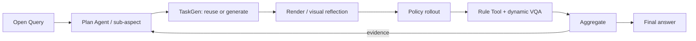

# MEA method evidence: eval_20260801_batch33_hyvla_plan_agent_control_v9

> Compact, movable view of one real method run. Complete raw telemetry and Aggregate payloads remain in the server evaluation directory.

## 1. Query and execution scope

> Does this Hy-VLA policy complete the unchanged official press_stapler task in RoboTwin? Run exactly one official control episode and answer only from that evidence.

- Task: `press_stapler`
- Policy: `Hy-VLA`
- Checkpoint: `tencent/Hy-Embodied-0.5-VLA-RoboTwin`
- Round budget / episodes: `1` / `[1]`

## 2. Paper-level data flow

## 3. Plan Agent trace

- Goal: answer_open_query_with_evidence: Does this Hy-VLA policy complete the unchanged official press_stapler task in RoboTwin? Run exactly one official control episode and answer only from that evidence.
- Initial round: `round_1`
- Final planning state: `stopped_after_round_1`
- Query interpretation trace: [prompt](artifacts/plan/query_interpretation_prompt.md) / [response 1](artifacts/plan/query_interpretation_response_1.txt)

## 4.1. `round_1` — Whether Hy-VLA completes the official press_stapler manipulation in a single control episode

### Plan → TaskGen

- Task: `press_stapler`
- Route/materialization: `official` / `official_passthrough`
- Gates: {"generation_attempts": null, "checker_fixtures": null, "vision_passed": null, "expert_passed": null}
- Generated/reused source: N/A (artifact was not present)

### Render / scene check

N/A - no real scene image was found.

### Rollout

- Backend/seeds: `Hy-VLA` / `[10000]`
- Pipeline/policy success: `True` / `1.0`

[Open policy video](assets/round_1_act.mp4)

<video src="assets/round_1_act.mp4" controls width="720"></video>

### Tool / VQA

- Tool: `reuse` → `official_check_success`
- Values: [{"role": "policy_under_evaluation", "policy_name": "Hy-VLA", "seed": 10000, "value": true, "unit": null, "passed": true}]
- VQA status: `None`; conflict: `None`

### Aggregate -> next decision

- Aggregate: {"status": "passed", "source_count": 1, "episode_result_count": 1, "unique_episode_count": 1, "metric_ids": ["official_check_success"], "input_issue_count": 0}
- Decision: {"action": "stop", "transition": "stop", "decision_reason": "provider_authored_open_world_step", "observation_summary": "The completed evidence is sufficient and authoritative for the requested single episode: the unchanged official control received outcome success with official_check_success=true. This answers the Query without making a statistical generalization beyond that episode.", "answered_query": true, "evidence_sufficient": null, "claim_verdict": null, "stop_reason": null}

## 5. Final answer to the original Query

> 是。在未改变的 RoboTwin 官方 press_stapler 任务上，Hy-VLA 的 1 个官方控制回合通过了官方成功检查（official_check_success=true），因此该回合完成了任务。

- Finding: Hy-VLA 在该回合的 policy_success=1.0。
- Finding: 官方检查在证据步 2866 记录成功，且无证据冲突。
- Finding: 执行流水线和测量工具均通过。
- Next: 在保持官方任务与检查器不变的前提下，使用更多独立种子和回合重复评估，以估计稳定成功率。
- Limitation: 证据仅覆盖 N=1、种子 10000 的单个回合。
- Limitation: 本次因有限查询充分性契约满足而停止，不构成统计意义上的泛化保证。
- Limitation: 未测试其他种子、场景变化或更多回合。
- Limitation: Evidence contains N=1 policy episodes at seeds [10000].
- Limitation: The run stopped because the finite query-sufficiency contract was satisfied; this is not a statistical generalization guarantee.
## 6. Boundaries

- Policy results and pipeline status are reported separately.
- Expert evidence, when present, is a solvability/instrumentation gate, not evaluated-policy performance.
- Few-shot N=1 rounds demonstrate method wiring, not benchmark-level generalization.
- Missing artifacts are shown as N/A; this report never substitutes proxy images or invented values.

## 7. Artifact index

- [Compact machine summary](run_summary.json)
- [Published-file inventory with bytes and SHA-256](evidence_bundle_manifest.json)
- Complete raw source remains server-side at `mea/evaluation_runs/eval_20260801_batch33_hyvla_plan_agent_control_v9`.
