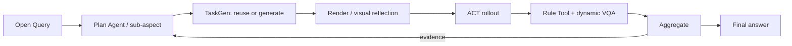
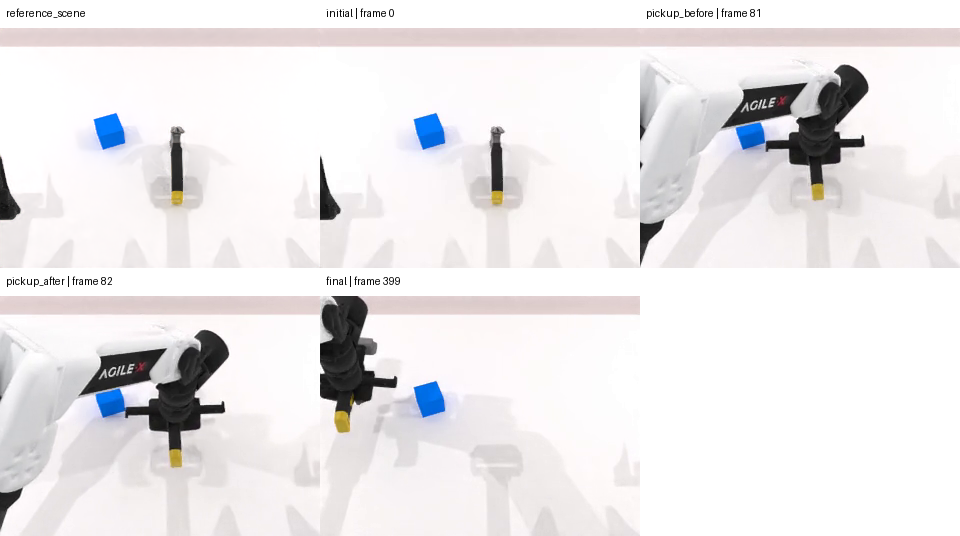
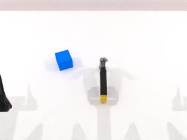

# MEA method evidence: eval_20260719_batch11_bbh_adaptive_n1_v3

> This is a compact view of real run artifacts. The complete machine audit remains in the evaluation directory.

## 1. Query and fixed policy scope

> For this beat_block_hammer ACT checkpoint, evaluate object-appearance generalization first and use the observed evidence to decide whether pickup-to-contact timing should be tested next. Return strengths, weaknesses, recommendations, and limitations. Stay within this one task and checkpoint.

```json
{
  "binding_mode": "single_task_single_checkpoint",
  "task_name": "beat_block_hammer",
  "task_profile": "generated",
  "policy": {
    "name": "ACT",
    "checkpoint_setting": "demo_clean",
    "expert_data_num": 50,
    "language_conditioned": false
  },
  "checkpoint": {
    "policy_name": "ACT",
    "checkpoint_setting": "demo_clean",
    "expert_data_num": 50,
    "checkpoint_id": "act-beat_block_hammer/demo_clean-50",
    "ready": true
  },
  "round_budget": 2,
  "episodes_per_round": [
    1,
    1
  ]
}
```

One evaluation keeps this task and ACT checkpoint fixed. Adaptation happens only across this task's sub-aspects/variants.

## 2. Paper-level data flow



## 3. Initial decomposition

```json
{
  "evaluation_goal": "evaluate the requested supported capability",
  "selected_aspect_ids": [
    "object_appearance.color",
    "performance.pickup_to_contact_timing"
  ],
  "requested_template_ids": [
    "object_appearance.color_blue",
    "performance.pickup_to_contact_timing"
  ],
  "first_round": "round_1",
  "planning_state": "stopped_after_round_2_by_hard_cap"
}
```

## 4.1. round_1: object_appearance.color

### Plan -> TaskProposal

```json
{
  "schema_version": 1,
  "proposal_id": "object_appearance.color_blue",
  "task_name": "beat_block_hammer",
  "aspect_id": "object_appearance.color",
  "intent": "把 beat_block_hammer 任务中的红色方块改成蓝色，其他行为保持不变。",
  "capability_id": "object_appearance.color",
  "reuse_first": true,
  "changes": {
    "block": {
      "position_mode": "official_random",
      "yaw_mode": "official_random",
      "scale": 1.0,
      "color": [
        0.0,
        0.2,
        1.0
      ]
    }
  },
  "preserve_success_semantics": true
}
```

### TaskGen output

- Route: `force_codegen`
- Materialization: `force_codegen`
- Child run: `run_20260719_batch11_bbh_adaptive_n1_v3_round_1`
- Full task artifact: [round_1_task.py](code/round_1_task.py)

```python
"""TaskGen output: canonical BeatBlockHammer with a generated load_actors."""

import numpy as np
import sapien

from envs.beat_block_hammer import beat_block_hammer as OfficialBeatBlockHammer
from envs.utils import create_actor, create_box, rand_pose


class beat_block_hammer(OfficialBeatBlockHammer):
    def load_actors(self):
        self.hammer = create_actor(
            scene=self,
            pose=sapien.Pose([0, -0.06, 0.783], [0, 0, 0.995, 0.105]),
            modelname="020_hammer",
            convex=True,
            model_id=0,
        )
        block_pose = rand_pose(
            xlim=[-0.25, 0.25],
            ylim=[-0.05, 0.15],
            zlim=[0.76],
            qpos=[1, 0, 0, 0],
            rotate_rand=True,
            rotate_lim=[0, 0, 0.5],
        )
        while abs(block_pose.p[0]) < 0.05 or np.sum(pow(block_pose.p[:2], 2)) < 0.001:
            block_pose = rand_pose(
                xlim=[-0.25, 0.25],
                ylim=[-0.05, 0.15],
                zlim=[0.76],
                qpos=[1, 0, 0, 0],
                rotate_rand=True,
                rotate_lim=[0, 0, 0.5],
            )

        self.block = create_box(
            scene=self,
            pose=block_pose,
            half_size=(0.025, 0.025, 0.025),
            color=(0.0, 0.2, 1.0),
            name="box",
            is_static=True,
        )
        self.hammer.set_mass(0.001)

        self.add_prohibit_area(self.hammer, padding=0.10)
        self.prohibited_area.append([
            block_pose.p[0] - 0.05,
            block_pose.p[1] - 0.05,
            block_pose.p[0] + 0.05,
            block_pose.p[1] + 0.05,
        ])
```
- VariantSpec: [round_1_variant_spec.json](data/round_1_variant_spec.json)

### Render / scene check


### ACT rollout

```json
{
  "backend": "ACT",
  "seeds": [
    100000
  ],
  "pipeline_passed": true,
  "policy_success": 0.0
}
```

[Open ACT video](assets/round_1_act.mp4)

<video src="assets/round_1_act.mp4" controls width="720"></video>

### ToolProposal -> ToolGen / reuse

```json
{
  "schema_version": 1,
  "proposal_id": "object_appearance.color_blue.tool",
  "task_name": "beat_block_hammer",
  "aspect_id": "object_appearance.color",
  "evaluation_goal": "先隔离用户指定的蓝色外观变化。",
  "metric": "hammer_block_contact_ever",
  "question": "蓝色方块场景中，锤子是否与方块发生过严格物理接触？",
  "vqa_phenomenon_ids": [
    "block_color_blue",
    "hammer_visibly_lifted",
    "block_visibly_displaced"
  ],
  "reuse_first": true
}
```

```json
{
  "route": "reuse",
  "metric": "hammer_block_contact_ever",
  "episodes": [
    {
      "role": "policy_under_evaluation",
      "policy_name": "ACT",
      "seed": 100000,
      "value": false,
      "unit": null,
      "passed": false
    },
    {
      "role": "expert_validation",
      "policy_name": "expert",
      "seed": 100000,
      "value": true,
      "unit": null,
      "passed": true
    }
  ]
}
```

### Dynamic VQA

```json
{
  "status": "passed",
  "questions": [
    {
      "id": "block_color_blue",
      "question": "Does the target block appear blue in the rollout?"
    },
    {
      "id": "hammer_visibly_lifted",
      "question": "Is the hammer visibly lifted above its initial resting height?"
    },
    {
      "id": "block_visibly_displaced",
      "question": "Is the target block visibly displaced from its initial pose?"
    }
  ],
  "phenomena": [
    {
      "id": "block_color_blue",
      "observed": true,
      "description": "The target block appears blue.",
      "confidence": 0.99,
      "frame_ids": [
        "initial"
      ]
    },
    {
      "id": "hammer_visibly_lifted",
      "observed": true,
      "description": "The hammer is visibly raised above its initial resting position after pickup.",
      "confidence": 0.97,
      "frame_ids": [
        "initial",
        "pickup_after"
      ]
    },
    {
      "id": "block_visibly_displaced",
      "observed": true,
      "description": "The target block appears visibly shifted from its initial pose by the final frame.",
      "confidence": 0.82,
      "frame_ids": [
        "initial",
        "final"
      ]
    }
  ],
  "numeric_consistency": "consistent",
  "evidence_conflict": false
}
```



### Aggregate -> next decision

```json
{
  "aggregate_status": "passed",
  "policy_success": 0.0,
  "decision": {
    "schema_version": 2,
    "action": "continue",
    "observation_summary": "外观泛化检查已完成：蓝色方块被正确生成并由视觉证据确认，全部 pipeline gates 通过，场景对齐、专家可解和执行流水线均正常；专家成功完成拾取、接触和位移，说明蓝色外观不破坏任务可解性。ACT 也成功拾取锤子并使方块发生可见位移，且最小 XY 误差为 0.0149 m、低于 0.02 m 阈值，但未发生严格物理接触，policy_success 为 0。优势是外观变化被隔离且证据一致；弱点是 ACT 在接触阶段失败，且仅有 1 个 seed，不能充分证明跨位置或更广泛对象外观的泛化。",
    "decision_reason": "遵守 deterministic evidence policy：round_1 的 metric evidence 完整有效，aggregate 和所有 required gates 均通过，因此 required_action 为 continue，不能停止或复核同一模板。现有证据足以完成外观检查，但 ACT 已拾取而未接触，first_contact_step 对 policy 缺失；专家在 physics step 1046 拾取并于 1461 接触，表明 pickup-to-contact timing 是当前最直接的未解析限制。建议继续测试该剩余模板，以区分拾取能力与接触时序控制；局限是 round_1 不能单独估计时序分布或泛化稳定性。",
    "next_template_id": "performance.pickup_to_contact_timing",
    "remaining_template_ids_before_decision": [
      "performance.pickup_to_contact_timing"
    ],
    "round_budget_before_decision": 1,
    "evidence_assessment": {
      "schema_version": 1,
      "state": "sufficient",
      "required_action": "continue",
      "reasons": [],
      "checks": {
        "metric": "hammer_block_contact_ever",
        "expected_policy_episodes": 1,
        "aggregate_status": "passed",
        "input_issue_count": 0,
        "valid": 1,
        "missing": 0,
        "invalid": 0,
        "semantic_missing": 0,
        "semantic_missing_reasons": [],
        "observed_policy_episodes": 1,
        "complete": true,
        "reasons": []
      },
      "latest_round_id": "round_1",
      "latest_template_id": "object_appearance.color_blue",
      "verification_of": "object_appearance.color_blue",
      "verification_attempts_used": 0,
      "round_budget_remaining": 1,
      "remaining_template_ids": [
        "performance.pickup_to_contact_timing"
      ],
      "unresolved": false
    },
    "next_round": {
      "round_id": "round_2",
      "template_id": "performance.pickup_to_contact_timing",
      "capability_id": "object_appearance.color",
      "task_variant_id": "object_appearance.color_blue",
      "capability_contract": {
        "schema_version": 1,
        "task_name": "beat_block_hammer",
        "template_id": "performance.pickup_to_contact_timing",
        "aspect": {
          "aspect_id": "performance.pickup_to_contact_timing",
          "semantic_scope": "performance",
          "target_role": "execution"
        },
        "taskgen": {
          "operation": "reuse_variant",
          "capability_id": "object_appearance.color",
          "task_variant_id": "object_appearance.color_blue",
          "controlled_axis": "object_appearance",
          "change_scope": "object",
          "generation_mode": "reuse",
          "allowed_change_roots": [
            "block"
          ],
          "changes": {
            "block": {
              "position_mode": "official_random",
              "yaw_mode": "official_random",
              "scale": 1.0,
              "color": [
                0.0,
                0.2,
                1.0
              ]
            }
          }
        },
        "tool": {
          "request_factory_id": "pickup_to_contact_tool_request",
          "metric": "pickup_to_first_contact_time"
        },
        "vqa": {
          "phenomenon_ids": [
            "hammer_visibly_lifted",
            "block_visibly_displaced"
          ]
        },
        "required_gates": [
          "variant_spec",
          "render",
          "rule",
          "scene_variant",
          "vision",
          "expert",
          "act",
          "toolkit",
          "planned_tool",
          "aggregate",
          "execution_vqa"
        ]
      },
      "sub_aspect": "performance.pickup_to_contact_timing",
      "rationale": "量化锤子首次抬升到首次严格物理接触的经过时间。",
      "task_instruction": "保持 beat_block_hammer 的方块为蓝色、官方位置与朝向随机化以及其他任务行为不变，评估 1 个 episode，并分析从锤子首次抬升到首次严格物理接触方块的时间。",
      "route": "reuse",
      "variant_hint": {
        "block": {
          "position_mode": "official_random",
          "yaw_mode": "official_random",
          "scale": 1.0,
          "color": [
            0.0,
            0.2,
            1.0
          ]
        }
      },
      "execution": {
        "seeds": [
          100000
        ],
        "num_episodes": 1,
        "gates": [
          "variant_spec",
          "render",
          "rule",
          "scene_variant",
          "vision",
          "expert",
          "act",
          "toolkit",
          "planned_tool",
          "aggregate",
          "execution_vqa"
        ]
      },
      "observations": [
        "scene_alignment",
        "observed_color",
        "expert_solvable",
        "act_pipeline_status",
        "policy_success"
      ],
      "tool_request": {
        "schema_version": 1,
        "task_name": "beat_block_hammer",
        "metric": "pickup_to_first_contact_time",
        "question": "蓝色方块场景中，从锤子首次抬升达到 pickup 阈值到首次严格物理接触方块，经过多少秒？"
      },
      "vqa_phenomenon_ids": [
        "hammer_visibly_lifted",
        "block_visibly_displaced"
      ],
      "task_proposal": {
        "schema_version": 1,
        "proposal_id": "object_appearance.color_blue",
        "task_name": "beat_block_hammer",
        "aspect_id": "performance.pickup_to_contact_timing",
        "intent": "保持 beat_block_hammer 的方块为蓝色、官方位置与朝向随机化以及其他任务行为不变，评估 1 个 episode，并分析从锤子首次抬升到首次严格物理接触方块的时间。",
        "capability_id": "object_appearance.color",
        "reuse_first": true,
        "changes": {
          "block": {
            "position_mode": "official_random",
            "yaw_mode": "official_random",
            "scale": 1.0,
            "color": [
              0.0,
              0.2,
              1.0
            ]
          }
        },
        "preserve_success_semantics": true
      },
      "tool_proposal": {
        "schema_version": 1,
        "proposal_id": "performance.pickup_to_contact_timing.tool",
        "task_name": "beat_block_hammer",
        "aspect_id": "performance.pickup_to_contact_timing",
        "evaluation_goal": "量化锤子首次抬升到首次严格物理接触的经过时间。",
        "metric": "pickup_to_first_contact_time",
        "question": "蓝色方块场景中，从锤子首次抬升达到 pickup 阈值到首次严格物理接触方块，经过多少秒？",
        "vqa_phenomenon_ids": [
          "hammer_visibly_lifted",
          "block_visibly_displaced"
        ],
        "reuse_first": true
      }
    }
  }
}
```

## 4.2. round_2: performance.pickup_to_contact_timing

### Plan -> TaskProposal

```json
{
  "schema_version": 1,
  "proposal_id": "object_appearance.color_blue",
  "task_name": "beat_block_hammer",
  "aspect_id": "performance.pickup_to_contact_timing",
  "intent": "保持 beat_block_hammer 的方块为蓝色、官方位置与朝向随机化以及其他任务行为不变，评估 1 个 episode，并分析从锤子首次抬升到首次严格物理接触方块的时间。",
  "capability_id": "object_appearance.color",
  "reuse_first": true,
  "changes": {
    "block": {
      "position_mode": "official_random",
      "yaw_mode": "official_random",
      "scale": 1.0,
      "color": [
        0.0,
        0.2,
        1.0
      ]
    }
  },
  "preserve_success_semantics": true
}
```

### TaskGen output

- Route: `reuse`
- Materialization: `reuse`
- Child run: `run_20260719_batch11_bbh_adaptive_n1_v3_round_2`
- Full task artifact: [round_2_overlay.yml](code/round_2_overlay.yml)

```yaml
mea:
  enabled: true
  block:
    position_mode: official_random
    yaw_mode: official_random
    scale: 1.0
    color:
    - 0.0
    - 0.2
    - 1.0
```
- VariantSpec: [round_2_variant_spec.json](data/round_2_variant_spec.json)

### Render / scene check



### ACT rollout

```json
{
  "backend": "ACT",
  "seeds": [
    100000
  ],
  "pipeline_passed": true,
  "policy_success": 0.0
}
```

[Open ACT video](assets/round_2_act.mp4)

<video src="assets/round_2_act.mp4" controls width="720"></video>

### ToolProposal -> ToolGen / reuse

```json
{
  "schema_version": 1,
  "proposal_id": "performance.pickup_to_contact_timing.tool",
  "task_name": "beat_block_hammer",
  "aspect_id": "performance.pickup_to_contact_timing",
  "evaluation_goal": "量化锤子首次抬升到首次严格物理接触的经过时间。",
  "metric": "pickup_to_first_contact_time",
  "question": "蓝色方块场景中，从锤子首次抬升达到 pickup 阈值到首次严格物理接触方块，经过多少秒？",
  "vqa_phenomenon_ids": [
    "hammer_visibly_lifted",
    "block_visibly_displaced"
  ],
  "reuse_first": true
}
```

```json
{
  "route": "force_codegen",
  "metric": "pickup_to_first_contact_time",
  "episodes": [
    {
      "role": "policy_under_evaluation",
      "policy_name": "ACT",
      "seed": 100000,
      "value": null,
      "unit": "s",
      "passed": null
    },
    {
      "role": "expert_validation",
      "policy_name": "expert",
      "seed": 100000,
      "value": 1.6479999999999997,
      "unit": "s",
      "passed": null
    }
  ]
}
```

[Open generated/reused Tool source](code/round_2_tool.py)

```python
def generated_tool(trajectory):
    hammer_z = trajectory.trace["hammer_position"][:, 2]
    initial_z = float(hammer_z[0])
    threshold = float(
        trajectory.schema.get("pickup_height_threshold_m", 0.03)
    )
    rise = hammer_z - initial_z
    pickup_indices = np.where(rise >= threshold)[0]
    pickup_index = int(pickup_indices[0]) if len(pickup_indices) else None
    pickup_step = (
        int(trajectory.trace["physics_step"][pickup_index])
        if pickup_index is not None
        else None
    )
    pickup_time = (
        float(trajectory.trace["simulation_time_seconds"][pickup_index])
        if pickup_index is not None
        else None
    )

    contacts = [
        item
        for item in trajectory.hammer_block_contacts()
        if item.get("physical_contact", False)
    ]
    first_contact = (
        min(
            contacts,
            key=lambda item: item["first_physical_physics_step"],
        )
        if contacts
        else None
    )
    contact_step = (
        int(first_contact["first_physical_physics_step"])
        if first_contact is not None
        else None
    )
    contact_time = (
        float(first_contact["first_physical_simulation_time_seconds"])
        if first_contact is not None
        else None
    )

    pickup_detected = pickup_index is not None
    contact_detected = first_contact is not None
    ordering_valid = (
        pickup_detected
        and contact_detected
        and contact_time >= pickup_time
    )
    contact_precedes_pickup = (
        pickup_detected
        and contact_detected
        and contact_time < pickup_time
    )

    reason = (
        "pickup_not_observed"
        if not pickup_detected
        else (
            "contact_not_observed_after_pickup"
            if not contact_detected
            else (
                "contact_precedes_pickup"
                if contact_precedes_pickup
                else "measured"
            )
        )
    )
    duration_seconds = (
        contact_time - pickup_time if ordering_valid else None
    )
    duration_physics_steps = (
        contact_step - pickup_step if ordering_valid else None
    )

    return {
        "value": duration_seconds,
        "unit": "s",
# ... truncated; open the linked artifact for the full source
```

### Dynamic VQA

```json
{
  "status": "passed",
  "questions": [
    {
      "id": "hammer_visibly_lifted",
      "question": "Is the hammer visibly lifted above its initial resting height?"
    },
    {
      "id": "block_visibly_displaced",
      "question": "Is the target block visibly displaced from its initial pose?"
    }
  ],
  "phenomena": [
    {
      "id": "hammer_visibly_lifted",
      "observed": true,
      "description": "The hammer is visibly raised above its resting position and held by the gripper.",
      "confidence": 0.99,
      "frame_ids": [
        "initial",
        "pickup_after"
      ]
    },
    {
      "id": "block_visibly_displaced",
      "observed": true,
      "description": "The blue target block appears slightly displaced between the initial and final rollout frames.",
      "confidence": 0.78,
      "frame_ids": [
        "initial",
        "final"
      ]
    }
  ],
  "numeric_consistency": "consistent",
  "evidence_conflict": false
}
```


### Aggregate -> next decision

```json
{
  "aggregate_status": "passed",
  "policy_success": 0.0,
  "decision": {
    "schema_version": 2,
    "action": "stop",
    "observation_summary": "Completed 2 round(s); the task-agnostic hard execution cap is now exhausted.",
    "decision_reason": "external_max_agent_rounds_budget",
    "next_template_id": null,
    "remaining_template_ids_before_decision": [],
    "round_budget_before_decision": 0,
    "evidence_assessment": {
      "schema_version": 1,
      "state": "external_hard_round_cap_reached",
      "required_action": "stop",
      "completed_rounds": 2,
      "max_agent_rounds": 2,
      "remaining_template_ids": [],
      "policy_outcome_not_inferred": true
    },
    "next_round": null
  }
}
```

## 5. Final answer to the original Query

> 场景生成和评估流水线通过，但 ACT policy 在本次 episode 未完成任务（policy_success=0.0）。

```json
{
  "findings": [
    "蓝色方块在两轮中均被视觉证据确认，scene_alignment 为 true，Execution VQA 的 evidence_conflict 为 false；这支持本次蓝色外观变体生成和观测流程正常。",
    "ACT 的拾取指标有效且通过：aggregate 中 first_hammer_pickup_step 的 policy_under_evaluation cohort 为 2 个有效结果，mean/median/min/max 均为 6284 physics_step，true_rate 为 1.0；hammer_pickup_height 的均值为 0.12761491537094116 m，拾取阈值检查通过率为 1.0。",
    "ACT 的 hammer_block_min_xy_error 均值为 0.014917366206645966 m，阈值检查通过率为 1.0；但 simulator numeric Tool 仍报告无严格物理接触，且 max_contact_impulse 的均值为 0.0 N*s。可见位移不能替代数值接触结论。",
    "pickup-to-first-contact timing 已被测试，但 ACT 的该指标为缺失，quality 为 valid 0、missing 1，原因是 pickup 后未观察到 contact；因此不能推断 ACT 的接触耗时。",
    "expert_validation cohort 仅用于仪器和场景可解性控制：expert 两次官方成功率为 1.0，pickup-to-first-contact_time 的均值为 1.6479999999999997 s；该结果不是 ACT 表现，不能与 ACT cohort 合并。",
    "本次证据显示 ACT 能够拾取锤子并接近方块，但在严格物理接触阶段失败；这使接触执行而非蓝色外观生成成为当前最直接的未解决问题。",
    "场景生成、视觉对齐和评估流水线已完成。",
    "ACT policy 在本次 episode 未完成任务，policy_success=0.0。"
  ],
  "recommended_next_step": "在保持蓝色方块和相同任务语义的前提下，优先进行更多 ACT episodes，并使用多个官方随机 seed/位置，继续记录严格物理接触率、first_contact_step、pickup-to-first-contact_time、contact impulse 和 official_check_success；重点区分拾取已成功但接触未发生的执行问题，并在获得有效 ACT 接触样本后再评估其时序分布。",
  "limitations": [
    "ACT 仅有 2 个 episode，且均为 seed 100000；实际位置未形成变化样本，不能据此证明跨位置、跨 seed 或更广泛对象外观的泛化。",
    "ACT 未发生物理接触，因此 first_contact_step、pickup-to-first-contact_time 和 time_to_success 对 ACT 均为缺失，不应视为通过或失败的数值时长指标。",
    "expert 结果与 ACT 属于不同 cohort，只能验证场景可解性和 instrumentation，不能用来补充或替代 ACT 的成功率、接触率或时序结果。",
    "Execution VQA 仅支持蓝色外观、可见抬升和可见位移等视觉现象；接触、冲量和官方成功仍以 simulator numeric Tool 为准。",
    "本次规划在两轮后达到 hard cap，结果仅覆盖指定任务和 checkpoint，不能外推到其他任务、checkpoint 或对象属性。"
  ]
}
```

## 6. Boundaries

- Policy results and pipeline status are reported separately.
- Expert evidence, when present, is a solvability/instrumentation gate, not ACT performance.
- Few-shot N=1 rounds demonstrate method wiring, not benchmark-level generalization.
- Missing artifacts are shown as N/A; this report never substitutes proxy images or invented values.

## 7. Raw artifact index

- Server source: `mea/evaluation_runs/eval_20260719_batch11_bbh_adaptive_n1_v3/manifest.json`
- Server source: `mea/evaluation_runs/eval_20260719_batch11_bbh_adaptive_n1_v3/plan/evaluation_plan.json`
- Server source: `mea/evaluation_runs/eval_20260719_batch11_bbh_adaptive_n1_v3/plan/bound_task_session.json`
- Server source: `mea/evaluation_runs/eval_20260719_batch11_bbh_adaptive_n1_v3/summary/evidence_bundle.json`
- Server source: `mea/evaluation_runs/eval_20260719_batch11_bbh_adaptive_n1_v3/feedback/feedback.json`
- Server source: `mea/evaluation_runs/eval_20260719_batch11_bbh_adaptive_n1_v3/evaluation_report.md`
