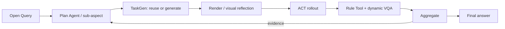
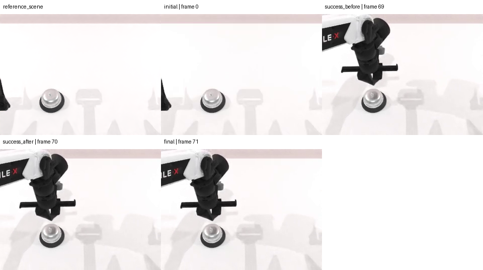

# MEA method evidence: eval_20260722_batch14_click_flagship_n1_v2

> This is a compact view of real run artifacts. The complete machine audit remains in the evaluation directory.

## 1. Query and fixed policy scope

> Evaluate how this fixed click_bell ACT checkpoint generalizes across bell positions and the official bell instance. Test position first; after real ACT, Rule Tool, and Dynamic VQA evidence, continue on the failure side or switch to object instance on success, then report strengths, weaknesses, recommendations, and limitations.

```json
{
  "binding_mode": "single_task_single_checkpoint",
  "task_name": "click_bell",
  "task_profile": "adaptive_properties",
  "policy": {
    "name": "ACT",
    "checkpoint_setting": "demo_clean",
    "expert_data_num": 50,
    "language_conditioned": false
  },
  "checkpoint": {
    "policy_name": "ACT",
    "checkpoint_setting": "demo_clean",
    "expert_data_num": 50,
    "checkpoint_id": "act-click_bell/demo_clean-50",
    "ready": true
  },
  "round_budget": 2,
  "episodes_per_round": [
    1,
    1
  ]
}
```

One evaluation keeps this task and ACT checkpoint fixed. Adaptation happens only across this task's sub-aspects/variants.

## 2. Paper-level data flow



## 3. Initial decomposition

```json
{
  "evaluation_goal": "evaluate the requested supported capability",
  "selected_aspect_ids": [
    "object_position",
    "object_instance"
  ],
  "requested_template_ids": [
    "object_position.left_fixed",
    "object_position.right_fixed",
    "object_instance.base0",
    "object_instance.base1"
  ],
  "first_round": "round_1",
  "planning_state": "stopped_after_round_2_by_hard_cap"
}
```

## 4.1. round_1: object_position

### Plan -> TaskProposal

```json
{
  "schema_version": 1,
  "proposal_id": "object_position.query_generated_1",
  "task_name": "click_bell",
  "aspect_id": "object_position",
  "intent": "evaluate a query-relevant bounded variation",
  "capability_id": "object_position.fixed_xy",
  "reuse_first": true,
  "changes": {
    "bell": {
      "position_mode": "fixed",
      "xy": [
        -0.14,
        -0.12
      ]
    }
  },
  "preserve_success_semantics": true
}
```

### TaskGen output

- Route: `reuse`
- Materialization: `bounded_variant_overlay`
- Child run: `run_20260722_batch14_click_flagship_n1_v2_round_1`
- Full task artifact: [round_1_overlay.yml](code/round_1_overlay.yml)

```yaml
mea:
  enabled: true
  bell:
    position_mode: fixed
    xy:
    - -0.14
    - -0.12
```
- VariantSpec: [round_1_variant_spec.json](data/round_1_variant_spec.json)

### Render / scene check


### ACT rollout

```json
{
  "backend": "ACT",
  "seeds": [
    100502
  ],
  "pipeline_passed": true,
  "policy_success": 1.0
}
```

[Open ACT video](assets/round_1_act.mp4)

<video src="assets/round_1_act.mp4" controls width="720"></video>

### ToolProposal -> ToolGen / reuse

```json
{
  "schema_version": 2,
  "proposal_id": "object_position.query_generated_1.tool",
  "task_name": "click_bell",
  "aspect_id": "object_position",
  "evaluation_goal": "measure task outcome and visible behavior",
  "metric": "bell_active_tcp_min_xy_error",
  "question": "What simulator measurement best diagnoses this aspect?",
  "vqa_phenomenon_ids": [
    "bell_visibly_pressed",
    "run_local.click_bell.object_position.query_observation"
  ],
  "vqa_question_specs": [
    {
      "question_type": "visible_state_change",
      "target_role": "task_target",
      "question": "Does the rollout visibly show the robot making task-relevant progress under the query-generated variation?",
      "visual_scope": "rollout_change",
      "numeric_authority": "official_check_success_is_authoritative",
      "id": "run_local.click_bell.object_position.query_observation"
    }
  ],
  "reuse_first": true
}
```

```json
{
  "route": "force_codegen",
  "metric": "bell_active_tcp_min_xy_error",
  "episodes": [
    {
      "role": "policy_under_evaluation",
      "policy_name": "ACT",
      "seed": 100502,
      "value": 0.009174784645438194,
      "unit": "m",
      "passed": null
    },
    {
      "role": "expert_validation",
      "policy_name": "expert",
      "seed": 100502,
      "value": 0.0006010743090882897,
      "unit": "m",
      "passed": null
    }
  ]
}
```

[Open generated/reused Tool source](code/round_1_tool.py)

```python
def generated_tool(trajectory):
    bell_position = trajectory.trace["bell_position"]
    bell_contact_position = trajectory.trace["bell_contact_position"]
    physics_step = trajectory.trace["physics_step"]
    simulation_time_seconds = trajectory.trace["simulation_time_seconds"]

    if float(bell_position[0, 0]) < 0:
        active_arm = "left"
        tcp_position = trajectory.trace["left_tcp_position"]
    else:
        active_arm = "right"
        tcp_position = trajectory.trace["right_tcp_position"]

    d = np.sqrt(
        (tcp_position[:, 0] - bell_contact_position[:, 0]) ** 2
        + (tcp_position[:, 1] - bell_contact_position[:, 1]) ** 2
    )
    minimum_index = int(
        np.argmin(np.where(np.isfinite(d), d, np.inf))
    )
    minimum_error = d[minimum_index]

    if not np.isfinite(minimum_error):
        return {
            "value": None,
            "unit": "m",
            "passed": None,
            "evidence_steps": [],
            "details": {
                "active_arm": active_arm,
                "min_error_physics_step": None,
                "simulation_time_seconds": None,
            },
        }

    return {
        "value": float(minimum_error),
        "unit": "m",
        "passed": None,
        "evidence_steps": [int(physics_step[minimum_index])],
        "details": {
            "active_arm": active_arm,
            "min_error_physics_step": int(physics_step[minimum_index]),
            "simulation_time_seconds": float(
                simulation_time_seconds[minimum_index]
            ),
        },
    }
```

### Dynamic VQA

```json
{
  "status": "passed",
  "questions": [
    {
      "id": "bell_visibly_pressed",
      "question": "Does the robot visibly press or actuate the target bell?"
    },
    {
      "id": "run_local.click_bell.object_position.query_observation",
      "question": "Does the rollout visibly show the robot making task-relevant progress under the query-generated variation?"
    }
  ],
  "phenomena": [
    {
      "id": "bell_visibly_pressed",
      "observed": true,
      "description": "The robot end effector is visibly positioned over and contacting the target bell in the post-action frames.",
      "confidence": 0.95,
      "frame_ids": [
        "success_after",
        "final"
      ]
    },
    {
      "id": "run_local.click_bell.object_position.query_observation",
      "observed": true,
      "description": "The rollout visibly shows task-relevant progress from the initial bell scene to the robot reaching and actuating the bell.",
      "confidence": 0.96,
      "frame_ids": [
        "initial",
        "success_before",
        "success_after",
        "final"
      ]
    }
  ],
  "numeric_consistency": "consistent",
  "evidence_conflict": false
}
```



### Aggregate -> next decision

```json
{
  "aggregate_status": "passed",
  "policy_success": 1.0,
  "decision": {
    "schema_version": 1,
    "action": "continue",
    "transition": "switch_aspect",
    "observation_summary": "Round 1 completed with all required gates passed. ACT succeeded on the fixed left-position variant (official success rate 1.0), with valid aggregate tool evidence and no input issues. The simulator confirmed the intended bell position and instance, and Dynamic VQA independently observed visible task-relevant progress and bell actuation without conflict. Pipeline success is separate from the policy result; neither indicates a policy failure here.",
    "decision_reason": "Trusted evidence is sufficient and the position probe succeeded, so the policy requires switching from the sufficiently characterized object_position aspect to the uncovered object_instance aspect. The remaining budget supports one continuation, and object_instance.base0 is an available trusted template.",
    "next_aspect_id": "object_instance",
    "next_template_id": "object_instance.base0",
    "evidence_assessment": {
      "schema_version": 1,
      "state": "sufficient",
      "pipeline_passed": true,
      "latest_round_id": "round_1",
      "latest_template_id": "object_position.left_fixed",
      "current_aspect_id": "object_position",
      "policy_success": 1.0,
      "aggregate_status": "passed",
      "evidence_conflict": false,
      "aggregate_checks": {
        "metric": "bell_active_tcp_min_xy_error",
        "expected_policy_episodes": 1,
        "aggregate_status": "passed",
        "input_issue_count": 0,
        "valid": 1,
        "missing": 0,
        "invalid": 0,
        "semantic_missing": 0,
        "semantic_missing_reasons": [],
        "observed_policy_episodes": 1,
        "complete": true,
        "reasons": []
      },
      "reasons": [
        "successful_sentinel_switches_to_uncovered_aspect"
      ],
      "unresolved": false,
      "round_budget_remaining": 1,
      "remaining_template_ids_by_aspect": {
        "object_position": [
          "object_position.right_fixed"
        ],
        "object_instance": [
          "object_instance.base0",
          "object_instance.base1"
        ]
      },
      "available_transitions": {
        "drill_down": [],
        "switch_aspect": [
          "object_instance"
        ]
      },
      "required_action": "continue",
      "required_transition": "switch_aspect",
      "required_next_aspect_id": "object_instance",
      "allowed_actions": [
        "continue"
      ],
      "evidence_packet": {
        "schema_version": 1,
        "round_id": "round_1",
        "template_id": "object_position.left_fixed",
        "pipeline": {
          "passed": true,
          "failure_stage": null
        },
        "policy": {
          "success_rate": 1.0,
          "reported": true
        },
        "rule": {
          "metric": "bell_active_tcp_min_xy_error",
          "expected_policy_episodes": 1,
          "aggregate_status": "passed",
          "input_issue_count": 0,
          "valid": 1,
          "missing": 0,
          "invalid": 0,
          "semantic_missing": 0,
          "semantic_missing_reasons": [],
          "observed_policy_episodes": 1,
          "complete": true,
          "reasons": []
        },
        "vqa": {
          "required": true,
          "status": "passed",
          "evidence_conflict": false
        },
        "evidence_strength": "sufficient",
        "reason_codes": []
      }
    },
    "next_round": {
      "round_id": "round_2",
      "template_id": "object_instance.base0",
      "capability_id": "object_instance.official_id",
      "task_variant_id": "object_instance.query_generated_1",
      "capability_contract": {
        "schema_version": 1,
        "task_name": "click_bell",
        "template_id": "object_instance.base0",
        "aspect": {
          "aspect_id": "object_instance",
          "semantic_scope": "object",
          "target_role": "task_target"
        },
        "taskgen": {
          "operation": "bounded_variant_overlay",
          "capability_id": "object_instance.official_id",
          "task_variant_id": "object_instance.base0",
          "controlled_axis": "object_instance",
          "change_scope": "object",
          "generation_mode": "bounded_variant_overlay",
          "allowed_change_roots": [
            "bell"
          ],
          "changes": {
            "bell": {
              "position_mode": "official_random",
              "instance_mode": "fixed",
              "bell_id": 0
            }
          }
        },
        "tool": {
          "request_factory_id": "official_success_tool_request",
          "metric": "official_check_success"
        },
        "vqa": {
          "phenomenon_ids": [
            "bell_visibly_pressed"
          ]
        },
        "required_gates": [
          "variant_spec",
          "render",
          "rule",
          "scene_variant",
          "vision",
          "expert",
          "act",
          "toolkit",
          "planned_tool",
          "aggregate",
          "execution_vqa"
        ]
      },
      "sub_aspect": "object_instance",
      "aspect_id": "object_instance",
      "probe_role": "sentinel",
      "rationale": "Official larger white/black base0 bell instance.",
      "task_instruction": "Evaluate how this fixed click_bell ACT checkpoint generalizes across bell positions and the official bell instance. Test position first; after real ACT, Rule Tool, and Dynamic VQA evidence, continue on the failure side or switch to object instance on success, then report strengths, weaknesses, recommendations, and limitations. Trusted bounded variant: Official larger white/black base0 bell instance. Query-generated bounded variation: evaluate a query-relevant bounded variation",
      "task_name": "click_bell",
      "task_module": "mea.tasks.click_bell",
      "telemetry_profile": "balanced_v1",
      "route": "reuse",
      "variant_hint": {
        "bell": {
          "position_mode": "official_random",
          "instance_mode": "fixed",
          "bell_id": 0
        }
      },
      "execution": {
        "backend": "act",
        "seeds": [
          100502
        ],
        "num_episodes": 1,
        "gates": [
          "variant_spec",
          "render",
          "rule",
          "scene_variant",
          "vision",
          "expert",
          "act",
          "toolkit",
          "planned_tool",
          "aggregate",
          "execution_vqa"
        ]
      },
      "observations": [
        "scene_alignment",
        "bell_position",
        "bell_instance_id",
        "scene_clutter",
        "scene_background_texture",
        "scene_lighting",
        "expert_solvable",
        "policy_success",
        "trusted_tools",
        "completion_time_statistics",
        "execution_vqa"
      ],
      "tool_request": {
        "schema_version": 1,
        "task_name": "click_bell",
        "metric": "official_check_success",
        "question": "What simulator measurement best diagnoses this aspect?"
      },
      "vqa_phenomenon_ids": [
        "bell_visibly_pressed",
        "run_local.click_bell.object_instance.query_observation"
      ],
      "task_proposal": {
        "schema_version": 1,
        "proposal_id": "object_instance.query_generated_1",
        "task_name": "click_bell",
        "aspect_id": "object_instance",
        "intent": "evaluate a query-relevant bounded variation",
        "capability_id": "object_instance.official_id",
        "reuse_first": true,
        "changes": {
          "bell": {
            "position_mode": "official_random",
            "instance_mode": "fixed",
            "bell_id": 0
          }
        },
        "preserve_success_semantics": true
      },
      "tool_proposal": {
        "schema_version": 2,
        "proposal_id": "object_instance.query_generated_1.tool",
        "task_name": "click_bell",
        "aspect_id": "object_instance",
        "evaluation_goal": "measure task outcome and visible behavior",
        "metric": "official_check_success",
        "question": "What simulator measurement best diagnoses this aspect?",
        "vqa_phenomenon_ids": [
          "bell_visibly_pressed",
          "run_local.click_bell.object_instance.query_observation"
        ],
        "vqa_question_specs": [
          {
            "question_type": "visible_state_change",
            "target_role": "task_target",
            "question": "Does the rollout visibly show the robot making task-relevant progress under the query-generated variation?",
            "visual_scope": "rollout_change",
            "numeric_authority": "official_check_success_is_authoritative",
            "id": "run_local.click_bell.object_instance.query_observation"
          }
        ],
        "reuse_first": true
      },
      "proposal_materialization": {
        "schema_version": 1,
        "mode": "query_generated_bounded_variation",
        "base_template_id": "object_instance.base0",
        "capability_contract_is_authority_envelope": true,
        "task_proposal_is_round_variation_authority": true
      }
    },
    "round_budget_before_decision": 1
  }
}
```

## 4.2. round_2: object_instance

### Plan -> TaskProposal

```json
{
  "schema_version": 1,
  "proposal_id": "object_instance.query_generated_1",
  "task_name": "click_bell",
  "aspect_id": "object_instance",
  "intent": "evaluate a query-relevant bounded variation",
  "capability_id": "object_instance.official_id",
  "reuse_first": true,
  "changes": {
    "bell": {
      "position_mode": "official_random",
      "instance_mode": "fixed",
      "bell_id": 0
    }
  },
  "preserve_success_semantics": true
}
```

### TaskGen output

- Route: `reuse`
- Materialization: `bounded_variant_overlay`
- Child run: `run_20260722_batch14_click_flagship_n1_v2_round_2`
- Full task artifact: [round_2_overlay.yml](code/round_2_overlay.yml)

```yaml
mea:
  enabled: true
  bell:
    position_mode: official_random
    instance_mode: fixed
    bell_id: 0
```
- VariantSpec: [round_2_variant_spec.json](data/round_2_variant_spec.json)

### Render / scene check


### ACT rollout

```json
{
  "backend": "ACT",
  "seeds": [
    100502
  ],
  "pipeline_passed": true,
  "policy_success": 1.0
}
```

[Open ACT video](assets/round_2_act.mp4)

<video src="assets/round_2_act.mp4" controls width="720"></video>

### ToolProposal -> ToolGen / reuse

```json
{
  "schema_version": 2,
  "proposal_id": "object_instance.query_generated_1.tool",
  "task_name": "click_bell",
  "aspect_id": "object_instance",
  "evaluation_goal": "measure task outcome and visible behavior",
  "metric": "official_check_success",
  "question": "What simulator measurement best diagnoses this aspect?",
  "vqa_phenomenon_ids": [
    "bell_visibly_pressed",
    "run_local.click_bell.object_instance.query_observation"
  ],
  "vqa_question_specs": [
    {
      "question_type": "visible_state_change",
      "target_role": "task_target",
      "question": "Does the rollout visibly show the robot making task-relevant progress under the query-generated variation?",
      "visual_scope": "rollout_change",
      "numeric_authority": "official_check_success_is_authoritative",
      "id": "run_local.click_bell.object_instance.query_observation"
    }
  ],
  "reuse_first": true
}
```

```json
{
  "route": "reuse",
  "metric": "official_check_success",
  "episodes": [
    {
      "role": "policy_under_evaluation",
      "policy_name": "ACT",
      "seed": 100502,
      "value": true,
      "unit": null,
      "passed": true
    },
    {
      "role": "expert_validation",
      "policy_name": "expert",
      "seed": 100502,
      "value": true,
      "unit": null,
      "passed": true
    }
  ]
}
```

### Dynamic VQA

```json
{
  "status": "passed",
  "questions": [
    {
      "id": "bell_visibly_pressed",
      "question": "Does the robot visibly press or actuate the target bell?"
    },
    {
      "id": "run_local.click_bell.object_instance.query_observation",
      "question": "Does the rollout visibly show the robot making task-relevant progress under the query-generated variation?"
    }
  ],
  "phenomena": [
    {
      "id": "bell_visibly_pressed",
      "observed": true,
      "description": "The robot visibly moves the end effector onto the target bell and actuates it.",
      "confidence": 0.96,
      "frame_ids": [
        "success_before",
        "success_after"
      ]
    },
    {
      "id": "run_local.click_bell.object_instance.query_observation",
      "observed": true,
      "description": "The rollout visibly shows task-relevant progress as the robot approaches and presses the bell.",
      "confidence": 0.97,
      "frame_ids": [
        "initial",
        "success_before",
        "success_after",
        "final"
      ]
    }
  ],
  "numeric_consistency": "consistent",
  "evidence_conflict": false
}
```


### Aggregate -> next decision

```json
{
  "aggregate_status": "passed",
  "policy_success": 1.0,
  "decision": {
    "schema_version": 2,
    "action": "stop",
    "observation_summary": "Completed 2 round(s); the task-agnostic hard execution cap is now exhausted.",
    "decision_reason": "external_max_agent_rounds_budget",
    "next_template_id": null,
    "remaining_template_ids_before_decision": [
      "object_position.right_fixed",
      "object_instance.base1"
    ],
    "round_budget_before_decision": 0,
    "evidence_assessment": {
      "schema_version": 1,
      "state": "external_hard_round_cap_reached",
      "required_action": "stop",
      "completed_rounds": 2,
      "max_agent_rounds": 2,
      "remaining_template_ids": [
        "object_position.right_fixed",
        "object_instance.base1"
      ],
      "policy_outcome_not_inferred": true
    },
    "next_round": null
  }
}
```

## 5. Final answer to the original Query

> 在 click_bell 任务中，固定 ACT checkpoint（act-click_bell/demo_clean-50，seed 100502）完成了 2 个 policy episode：左侧固定位置变体和官方 base0 bell instance，官方成功率为 2/2（1.0）。两轮全部验证门通过，且 Dynamic VQA 与 simulator 结果一致。评估流水线完成不等同于已证明广泛泛化；本次结果仅支持这两个已测试变体上的成功。

```json
{
  "findings": [
    "ACT 在 object_position.left_fixed 上官方成功率为 1/1；该轮 bell_active_tcp_min_xy_error 聚合结果为 mean/median/min/max 0.009174784645438194 m，质量为 valid 1、missing 0、invalid 0；time_to_success 为 19.484 s。",
    "ACT 在官方 object_instance.base0 上官方成功率为 1/1，说明该已测试官方 bell instance 上任务完成；time_to_success 为 20.216 s。",
    "两轮合并的 policy_under_evaluation cohort 官方成功率为 1.0（2/2），time_to_success mean/median 为 19.85 s，min 为 19.484 s，max 为 20.216 s，population stddev 为 0.36599999999999966 s；聚合质量为 valid 2、missing 0、invalid 0。",
    "Dynamic VQA 在两轮均观察到机器人到达并按压 bell，分别使用 success_before/success_after 等帧；evidence_conflict=false，numeric_consistency=consistent。数值成功结论仍以 simulator official_check_success 为准。",
    "expert_validation 两轮均成功，主要验证场景可解性与测量链路，不作为 ACT 性能结果；不得与 ACT cohort 合并解读。",
    "ACT 的优势是已在一个固定左侧位置和官方 base0 实例上完成任务；相对局限是已测样本中没有位置变化，不能据此确认跨位置泛化。"
  ],
  "recommended_next_step": "优先追加 object_position.right_fixed，并在多个 seeds 上重复左右位置测试；随后测试 object_instance.base1。每个变体应增加足够 episode 数，并继续使用 official_check_success 作为任务成功权威指标、Dynamic VQA 作为可见行为辅助证据。",
  "limitations": [
    "每个变体仅 1 个 ACT episode，且仅使用一个 seed 100502；few-episode 结果不是一般化基准。",
    "本次实际只覆盖左侧固定位置和 base0，右侧固定位置及 base1 尚未评估，因此不能声称覆盖全部请求的 position 或 instance 变化。",
    "两轮均为 bell_id 0，且场景无 clutter、无背景纹理 split、无随机 lighting；这些因素的泛化未被测试。",
    "颜色字段为 null，不能基于本次证据报告颜色相关结论。",
    "评估在第 2 轮后因 hard cap 停止；pipeline_passed=true 只表示评估流程和证据门完成，不代表未测试变体的结果。"
  ]
}
```

## 6. Boundaries

- Policy results and pipeline status are reported separately.
- Expert evidence, when present, is a solvability/instrumentation gate, not ACT performance.
- Few-shot N=1 rounds demonstrate method wiring, not benchmark-level generalization.
- Missing artifacts are shown as N/A; this report never substitutes proxy images or invented values.

## 7. Raw artifact index

- Server source: `mea/evaluation_runs/eval_20260722_batch14_click_flagship_n1_v2/manifest.json`
- Server source: `mea/evaluation_runs/eval_20260722_batch14_click_flagship_n1_v2/plan/evaluation_plan.json`
- Server source: `mea/evaluation_runs/eval_20260722_batch14_click_flagship_n1_v2/plan/bound_task_session.json`
- Server source: `mea/evaluation_runs/eval_20260722_batch14_click_flagship_n1_v2/summary/evidence_bundle.json`
- Server source: `mea/evaluation_runs/eval_20260722_batch14_click_flagship_n1_v2/feedback/feedback.json`
- Server source: `mea/evaluation_runs/eval_20260722_batch14_click_flagship_n1_v2/evaluation_report.md`
